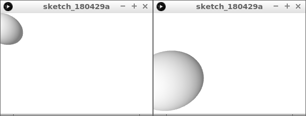

# 3D-lektion 1: bollen till höger

I den här lektionen ska vi programmera 3D.

\sidbrytning

## 3D 1: uppgift 1

Skriv denna kod över:

```c++
float x = 0;

void setup()
{
  storlek (300, 200, P3D);
  noStroke();
}

void draw()
{
  bakgrund(255, 255, 255);
  translate(x, 100, 0);
  ljus();
  sfär(20);
  x = x + 1;
}
```

Vad ser du?

\sidbrytning

## 3D 1: lösning 1


Du ser en boll som rör sig från vänster till höger.

Om man tittar noga kan man se att den vitaste delen av bollen också byter plats.

\sidbrytning

## 3D 1: uppgift 2

 * Låt nu bollen gå längst ner till höger
 * Skapa en ny variabel, till exempel `y`


\sidbrytning

## 3D 1: lösning 2

```c++
float x = 0;
flytande y = 0;

void setup()
{
  storlek (300, 200, P3D);
  noStroke();
}

void draw()
{
  bakgrund(255, 255, 255);
  translate(x, y, 0);
  ljus();
  sfär(20);
  x = x + 1;
  y = y + 1;
}
```

\sidbrytning

## 3D 1: uppgift 3

 * Låt nu bollen gå framåt
 * Skapa en ny variabel, till exempel `z`

Det här kan se annorlunda ut än du förväntar dig!



\sidbrytning

## 3D 1: lösning 3

```c++
float x = 0;
flytande y = 0;
float z = 0;

void setup()
{
  storlek (300, 200, P3D);
  noStroke();
}

void draw()
{
  bakgrund(255, 255, 255);
  translate(x, y, z);
  ljus();
  sfär(20);
  x = x + 1;
  y = y + 1;
  z = z + 1;
}
```


## 3D 1: Slutlig uppgift

 * Gör storleken på sfären lika med "x".
 * Ta bort 'noStroke'

Det här kan se annorlunda ut än du förväntar dig!

 

