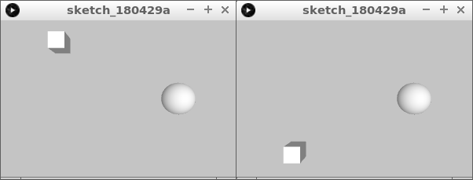

#3D Lektion 3: Flytta boll och kub

I den här lektionen ska vi göra en 3D-kula och kub-rörelse.

\sidbrytning

## 3D 3: uppgift 1

Skriv denna kod över:

```c++
float x1 = 0;
float x2 = 0;

void setup()
{
  storlek (300, 200, P3D);
  noStroke();
  x1 = bredd * 1/4;
  x2 = bredd * 3/4;
}

void draw()
{
  bakgrund (196, 196, 196);
  ljus();
  translate( x1, höjd / 2, 0);
  låda (20);
  translate(-x1, -height / 2, 0);

  translate( x2, höjd / 2, 0);
  sfär(20);
  translate(-x2, -height / 2, 0);
}
```

Vad ser du?

\sidbrytning

## 3D 3: lösning 1


Du ser en kub och en boll som står stilla
\sidbrytning

## 3D 3: uppgift 2

 * Se till att kuben nu också kan gå upp och ner, med tangenterna `w` och `s`
 * Skapa en ny variabel, t.ex. "y1", med initialvärdet "höjd / 2".



\sidbrytning

## 3D 3: lösning 2

```c++
float x1 = 0;
float x2 = 0;
float y1 = 0;

void setup()
{
  storlek (300, 200, P3D);
  noStroke();
  x1 = bredd * 1/4;
  x2 = bredd * 3/4;
  y1 = höjd / 2;
}

void draw()
{
  bakgrund (196, 196, 196);
  ljus();
  translate( x1, y1, 0);
  låda (20);
  translate(-xl, -yl, 0);

  translate( x2, höjd / 2, 0);
  sfär(20);
  translate(-x2, -height / 2, 0);
  
  om (knapptryckt)
  {
    om (nyckel == 'w') y1 = y1 - 1;
    om (nyckel == 's') y1 = y1 + 1;
  }
}
```

\sidbrytning

## 3D 3: Slutlig uppgift

 * Låt nu också bollen gå fram och tillbaka med tangenterna `i` och `k`
 * Skapa en ny variabel, t.ex. "y2", med initialvärdet "höjd / 2".


