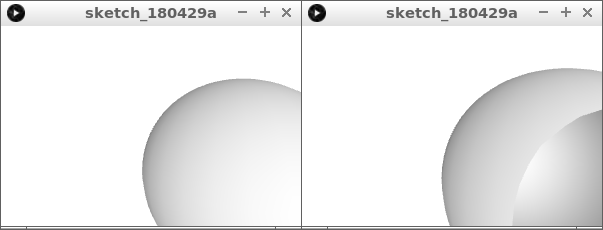

#3D Lektion 2: styra klotet

Under den här lektionen ska vi göra en 3D-bollrörelse.

\pagebreak

## 3D 2: uppgift 1

Skriv denna kod över:

```processing
float x = 0;

void setup() 
{
  size(300, 200, P3D);
  noStroke();
  x = width / 2;
}

void draw() 
{
  background(255, 255, 255);
  lights();
  translate(x, height / 2, 0);
  sphere(20);
  if (keyPressed) 
  {
    if (key == 'a') x = x - 1;
    if (key == 'd') x = x + 1;
  }
}
```

Vad ser du?

\pagebreak

## 3D 2: lösning 1


Du ser en boll som du kan gå till med `a` och `d`
kan flytta åt vänster och höger.

Om man tittar noga kan man se att den vitaste delen av bollen också byter plats.

\pagebreak

## 3D 2: uppgift 2

 * Se till att bollen nu också kan gå upp och ner, med tangenterna `w` och `s`
 * Skapa en ny variabel, t.ex. "y", med initialvärdet "höjd / 2".


\pagebreak

## 3D 2: lösning 2

```processing
float x = 0;
float y = 0;

void setup() 
{
  size(300, 200, P3D);
  noStroke();
}

void draw() 
{
  background(255, 255, 255);
  lights();
  translate(x, y, 0);
  sphere(20);
  x = x + 1;
  y = y + 1;
}
```

\pagebreak

## 3D 2: Slutuppgift

 * Få bollen att gå fram och tillbaka med tangenterna `q` och `e`
 * Skapa en ny variabel, t.ex. "z", med initialt värde noll

Det här kan se annorlunda ut än du förväntar dig!


