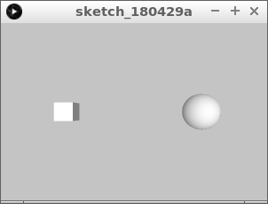
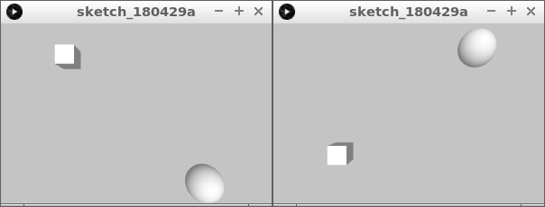

#3D Lektion 3: klotet och kuben

Under den här lektionen ska vi göra en 3D-kula och kub-rörelse.

\pagebreak

## 3D 3: uppgift 1

Skriv denna kod över:

```processing
float x1 = 0;
float x2 = 0;

void setup() 
{
  size(300, 200, P3D);
  noStroke();
  x1 = width * 1 / 4;
  x2 = width * 3 / 4;
}

void draw() 
{
  background(196, 196, 196);
  lights();
  translate( x1,  height / 2, 0);
  box(20);
  translate(-x1, -height / 2, 0);

  translate( x2,  height / 2, 0);
  sphere(20);
  translate(-x2, -height / 2, 0);
}
```

Vad ser du?

\pagebreak

## 3D 3: lösning 1



Du ser en kub och en boll som står stilla
\pagebreak

## 3D 3: uppgift 2

 * Se till att kuben nu också kan gå upp och ner, med tangenterna `w` och `s`
 * Skapa en ny variabel, t.ex. "y1", med initialvärdet "höjd / 2".


\pagebreak

## 3D 3: lösning 2

```processing
float x1 = 0;
float x2 = 0;
float y1 = 0;

void setup() 
{
  size(300, 200, P3D);
  noStroke();
  x1 = width * 1 / 4;
  x2 = width * 3 / 4;
  y1 = height / 2;
}

void draw() 
{
  background(196, 196, 196);
  lights();
  translate( x1,  y1, 0);
  box(20);
  translate(-x1, -y1, 0);

  translate( x2,  height / 2, 0);
  sphere(20);
  translate(-x2, -height / 2, 0);
  
  if (keyPressed)
  {
    if (key == 'w') y1 = y1 - 1; 
    if (key == 's') y1 = y1 + 1; 
  }
}
```

\pagebreak

## 3D 3: Slutuppgift

 * Låt nu också bollen gå fram och tillbaka med tangenterna `i` och `k`
 * Skapa en ny variabel, t.ex. "y2", med initialvärdet "höjd / 2".


