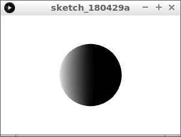

#3D Lektion 4: ljussättning

Under den här lektionen ska vi exponera en 3D-boll.

\pagebreak

## 3D 4: uppgift 1

Skriv denna kod över:

```processing
float ljus_rikting_x = 1;

void setup() 
{
  size(300, 200, P3D);
  noStroke();
}

void draw() 
{
  background(255, 255, 255);
  directionalLight(255, 255, 255, ljus_rikting_x, 0, 0);
  translate(width / 2, height / 2, 0);
  sphere(50);
}
```

Vad ser du?

\pagebreak

## 3D 4: lösning 1



Du kommer att se en boll med ett vitt ljus på.

\pagebreak

## 3D 4: uppgift 2

 * Se till att `ljus_riktning_x` kan bli lägre och högre, med tangenterna `w` och `s`

Observera: endast tre positioner är möjliga!


\pagebreak

## 3D 4: lösning 2

```processing
float ljus_rikting_x = 1;

void setup() 
{
  size(300, 200, P3D);
  noStroke();
}

void draw() 
{
  background(255, 255, 255);
  directionalLight(255, 255, 255, ljus_rikting_x, 0, 0);
  translate(width / 2, height / 2, 0);
  sphere(50);
  if (keyPressed)
  {
    if (key == 'a') ljus_rikting_x = ljus_rikting_x - 1;  
    if (key == 'd') ljus_rikting_x = ljus_rikting_x + 1;  
  }
}
```

\pagebreak

## 3D 3: uppgift 3

 * Ställ in ljusets y-riktning till ett.
 * Gör färgen på ljusröd

Obs: endast fem positioner är möjliga!


\pagebreak

## 3D 4: lösning 3

```processing
float ljus_rikting_x = 1;

void setup() 
{
  size(300, 200, P3D);
  noStroke();
}

void draw() 
{
  background(255, 255, 255);
  directionalLight(255, 0, 0, ljus_rikting_x, 1, 0);
  translate(width / 2, height / 2, 0);
  sphere(50);
  if (keyPressed)
  {
    if (key == 'a') ljus_rikting_x = ljus_rikting_x - 1;  
    if (key == 'd') ljus_rikting_x = ljus_rikting_x + 1;  
  }
}
```


\pagebreak

## 3D 4: Slutuppgift

 * Se till att `ljus_riktning_y` kan bli lägre och högre, med tangenterna `w` och `s`
 * Skapa en ny variabel, t.ex. `ljus_riktning_x`, med initialvärdet noll
 * Gör den ljusa färgen grön

Nu kan ljusstrålen rotera fint.


