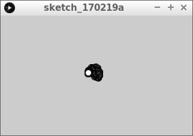
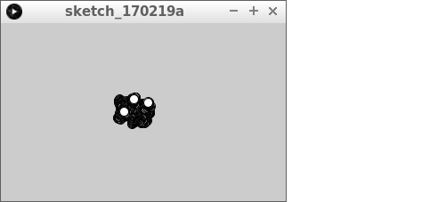

# Arrayer 2

Ännu fler arrayer!


\pagebreak

## Arrayer 2: Uppgift 1

Kör den här koden:

```processing
float x1 = 160;
float y1 = 100;

void setup() 
{
  size(320, 200);
}

void draw()
{
  x1 += random(-1,1);
  y1 += random(-1,1);
  ellipse(x1, y1, 10, 10);
}
```

\pagebreak

## Arrayer 2: lösning 1



Hah, en rökpartikel.

\pagebreak

## Arrayer 2: Uppgift 2


Gör en andra rökpartikel.

\pagebreak

## Arrayer 2: lösning 2

```processing
float x1 = 160;
float y1 = 100;
float x2 = 160;
float y2 = 100;

void setup() 
{
  size(320, 200);
}

void draw()
{
  x1 += random(-1,1);
  y1 += random(-1,1);
  ellipse(x1, y1, 10, 10);
  x2 += random(-1,1);
  y2 += random(-1,1);
  ellipse(x2, y2, 10, 10);
}
```

\pagebreak

## Arrayer 2: Uppgift 3

Använd nu en array, utan `for`-loop.

 | 
:-----------------:|:-----------------------------:
`float[] xs`|'Kära dator, kom ihåg många bråktal i en array som heter `xs`'

 | 
:-----------------:|:-----------------------------:
`xs = new float[2]`|'Kära dator, gör så att `xs` innehåller två lådor'

 | Tips: använd `xs[0]` istället för `x1` och `xs[1]` istället för `x2`
:-----------------:|:-----------------------------:

\pagebreak

## Arrayer 2: lösning 3

```processing
float[] xs;
float[] ys;

void setup() 
{
  size(320, 200);
  xs = new float[2];
  ys = new float[2];
  xs[0] = 160;
  xs[1] = 160;
  ys[0] = 100;
  ys[1] = 100;
}

void draw()
{
  xs[0] += random(-1,1);
  ys[0] += random(-1,1);
  ellipse(xs[0], ys[0], 10, 10);
  xs[1] += random(-1,1);
  ys[1] += random(-1,1);
  ellipse(xs[1], ys[1], 10, 10);
}
```

\pagebreak

## Arrayer 2: Uppgift 4



Använd nu `for`-loopar. Gör så att både arrayen `xs` och `ys` innehåller tre lådor.

 | 
:-----------------:|:-----------------------------:
`for (int i=0; i<3; i=i+1) {}`|'Kära dator, gör vad som står mellan måsvingarna. Låt `i` starta med värdet `0` och räkna upp så länge värdet är mindre `3`, med `1` steg i taget'

\pagebreak

## Arrayer 2: lösning 4

```processing
float[] xs;
float[] ys;

void setup() 
{
  size(320, 200);
  xs = new float[3];
  ys = new float[3];
  for (int i=0; i<3; ++i)
  {
    xs[i] = 160;
    ys[i] = 100;
  }
}

void draw()
{
  for (int i=0; i<3; ++i)
  {
    xs[i] += random(-1,1);
    ys[i] += random(-1,1);
    ellipse(xs[i], ys[i], 10, 10);
  }
}
```

\pagebreak

## Arrayer 2: Uppgift 5


Varje rökpartikel får nu sin egen röda kantfärg:

 * Skapa en tredje array som heter `rs`, för de röda nyanserna på rökpartiklarna
 * I `rs` måste siffrorna `0`, `64`, `128` och `196` finnas
 * De röda nyanserna ska slumpmässigt öka eller minska i rödhet
 * Kanten på den första rökpartikeln ska få den första röda nyansen. Tips: använd `stroke`

 | Tips: använd `stroke` för kantfärgen
:-----------------:|:-----------------------------:

\pagebreak

## Arrayer 2: lösning 5

```processing
float[] xs;
float[] ys;
float[] rs; //Roda varden

void setup() 
{
  size(320, 200);
  xs = new float[4];
  ys = new float[4];
  rs = new float[4];
  for (int i=0; i<4; ++i)
  {
    xs[i] = 160;
    ys[i] = 100;
    rs[i] = i * 64;
  }
}

void draw()
{
  for (int i=0; i<4; ++i)
  {
    xs[i] += random(-1,1);
    ys[i] += random(-1,1);
    rs[i] += random(-1,1);
    stroke(rs[i], 0, 0);
    ellipse(xs[i], ys[i], 10, 10);
  }
}
```

\pagebreak

## Arrayer 2: Slutuppgift


Gör nu koden så att:

 * det finns 256 rökpartiklar.
 * varje rökpartikel har sitt eget *blå* värde
 * den första rökpartikeln har ett blått värde på noll. Den andra rökpartikeln har ett blått värde på ett. Den tredje rökpartikeln har ett blått värde på två. Och så vidare
 * ifyllnadsfärgen ska vara blå den här gången, inte kanten

 | Tips: använd `fill` för ifyllnadsfärgen
:-----------------:|:-----------------------------:
