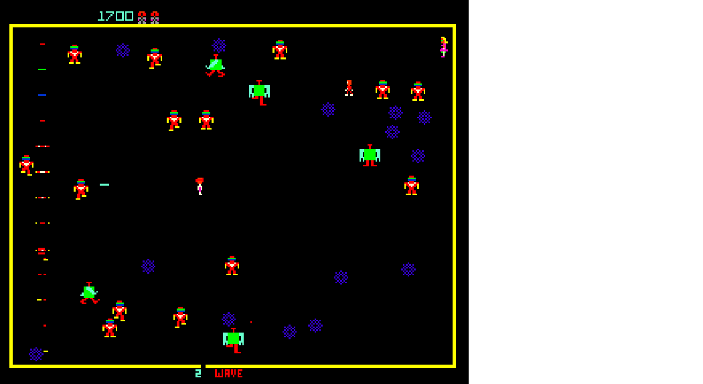

# Arrays2

Ännu fler arrayer!



\pagebreak

## Arrays 2: Kommando 1

Kör den här koden:

```c++
float x1 = 160;
float y1 = 100;

void setup() 
{
  size(320, 200);
}

void draw()
{
  x1 += random(-1,1);
  y1 += random(-1,1);
  ellipse(x1, y1, 10, 10);
}
```

\pagebreak

## Arrays 2: lösning 1


Ha, en rökpartikel.

\pagebreak

## Arrays 2: Kommando 2


Gör en andra rökpartikel.

\pagebreak

## Arrays 2: lösning 2

```c++
float x1 = 160;
float y1 = 100;
float x2 = 160;
float y2 = 100;

void setup() 
{
  size(320, 200);
}

void draw()
{
  x1 += random(-1,1);
  y1 += random(-1,1);
  ellipse(x1, y1, 10, 10);
  x2 += random(-1,1);
  y2 += random(-1,1);
  ellipse(x2, y2, 10, 10);
}
```

\pagebreak

## Arrays 2: Kommando 3

Använd nu en array, utan for loop.

 | 
:-----------------:|:---------------------- ------- :
`float[] xs`|'Bästa dator, kom ihåg många bråktal som heter `xs`'

 | 
:-----------------:|:---------------------- ------- :
`xs = new float[2]`|'Bästa dator, gör `xs` 2 lådor`'

 | Tips: använd "xs[0]" istället för "x1" och "xs[1]" istället för "x2"
:-----------------:|:---------------------- ------- :

\pagebreak

## Arrays 2: lösning 3

```c++
float[] xs;
float[] ys;

void setup() 
{
  size(320, 200);
  xs = new float[2];
  ys = new float[2];
  xs[0] = 160;
  xs[1] = 160;
  ys[0] = 100;
  ys[1] = 100;
}

void draw()
{
  xs[0] += random(-1,1);
  ys[0] += random(-1,1);
  ellipse(xs[0], ys[0], 10, 10);
  xs[1] += random(-1,1);
  ys[1] += random(-1,1);
  ellipse(xs[1], ys[1], 10, 10);
}
```

\pagebreak

## Arrays 2: Kommando 4


Använd nu för slingor. Gör både arrayen "xs" och "ys" tre lådor stora.

 | 
:-----------------:|:---------------------- ------- :
`for (int i=0; i<3; ++i) {}`|'Bästa dator, gör vad som står mellan klammerparenteser med värden på `i` från `0` till `3` i steg om `1` '

\pagebreak

## Arrays 2: lösning 4

```c++
float[] xs;
float[] ys;

void setup() 
{
  size(320, 200);
  xs = new float[3];
  ys = new float[3];
  for (int i=0; i<3; ++i)
  {
    xs[i] = 160;
    ys[i] = 100;
  }
}

void draw()
{
  for (int i=0; i<3; ++i)
  {
    xs[i] += random(-1,1);
    ys[i] += random(-1,1);
    ellipse(xs[i], ys[i], 10, 10);
  }
}
```

\pagebreak

## Arrays 2: Kommando 5


Varje rökpartikel får nu sin egen röda kantfärg:

 * Skapa en tredje array som heter "rs", för rodnad av rökpartiklarna
 * I "rs" måste siffrorna "0", "64", "128" och "196" finnas
 * Rodnaden ska också bli mer eller mindre
 * Kanten på den första rökpartikeln ska få den första rodnaden. Tips: använd `stroke`

 | Tips: använd `stroke` för kantfärgen
:-----------------:|:---------------------- ------- :

\pagebreak

## Arrays 2: lösning 5

```c++
float[] xs;
float[] ys;
float[] rs; //Roodwaarden

void setup() 
{
  size(320, 200);
  xs = new float[4];
  ys = new float[4];
  rs = new float[4];
  for (int i=0; i<4; ++i)
  {
    xs[i] = 160;
    ys[i] = 100;
    rs[i] = i * 64;
  }
}

void draw()
{
  for (int i=0; i<4; ++i)
  {
    xs[i] += random(-1,1);
    ys[i] += random(-1,1);
    rs[i] += random(-1,1);
    stroke(rs[i], 0, 0);
    ellipse(xs[i], ys[i], 10, 10);
  }
}
```

\pagebreak

## Arrays 2: Final Command


Gör nu koden så att:

 * det finns 256 rökpartiklar.
 * varje rökpartikel har sitt eget *blå* värde
 * den första rökpartikeln har ett blått värde på noll. Den andra rökpartikeln har ett blått värde på ett. Den tredje rökpartikeln har ett blått värde på två. Och så vidare
 * inte kanten, men fyllningsfärgen är blå

 | Tips: använd "fyll" för fyllningsfärgen
:-----------------:|:---------------------- ------- :
