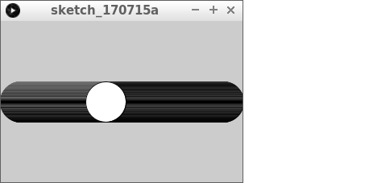
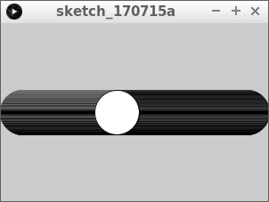
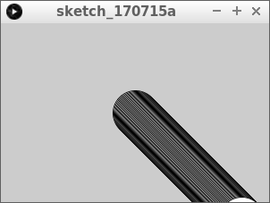
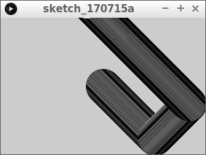
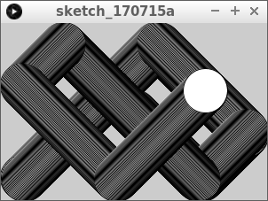

# Boll som studsar snett

Under den här lektionen ska vi studsa en boll snett diagonalt.

\pagebreak

## Boll som studsar: uppgift 1

```processing
float x = 150;
float hastighet_till_hoger = 1;

void setup()
{
  size(300, 200);
}

void draw()
{
  ellipse(x, 100, 50, 50);
  x = x + hastighet_till_hoger;
  if (x > 275)
  {
    hastighet_till_hoger = -hastighet_till_hoger;
  }
  if (x < 25)
  {
    hastighet_till_hoger = -hastighet_till_hoger;
  }
}
```



 * Skriv den här koden
 * Skapa en ny variabel som heter `y`.
 * Rita ut ovalen på koordinaten `(x, y)`.
 * Se till att koden fortsätter att göra samma sak

 | 
:-----------------:|:-----------------------------:
`float y = 50;` | 'Kära dator, kom ihåg talet `y` med ett startvärde av `50`.'

\pagebreak

## Boll som studsar: lösning 1

```processing
float x = 150;
float y = 100;
float hastighet_till_hoger = 1;

void setup()
{
  size(300, 200);
}

void draw()
{
  ellipse(x, y, 50, 50);
  x = x + hastighet_till_hoger;
  if (x > 275)
  {
    hastighet_till_hoger = -hastighet_till_hoger;
  }
  if (x < 25)
  {
    hastighet_till_hoger = -hastighet_till_hoger;
  }
}
```

\pagebreak

## Boll som studsar: uppgift 2



Skapa en ny variabel som heter `hastighet_nerat`.
Ge det initialvärdet för `1`. Bollen behöver inte röra sig än.

\pagebreak

## Boll som studsar: lösning 2

```processing
float x = 150;
float y = 100;
float hastighet_till_hoger = 1;
float hastighet_nerat = 1;

void setup()
{
  size(300, 200);
}

void draw()
{
  ellipse(x, y, 50, 50);
  x = x + hastighet_till_hoger;
  if (x > 275)
  {
    hastighet_till_hoger = -hastighet_till_hoger;
  }
  if (x < 25)
  {
    hastighet_till_hoger = -hastighet_till_hoger;
  }
}
```

\pagebreak

## Boll som studsar: uppgift 3



Låt nu bollen röra sig nedåt också. Den behöver inte studsa ännu.

\pagebreak

## Boll som studsar: lösning 3

```processing
float x = 150;
float y = 100;
float hastighet_till_hoger = 1;
float hastighet_till_nere = 1;

void setup()
{
  size(300, 200);
}

void draw()
{
  ellipse(x, y, 50, 50);
  x = x + hastighet_till_hoger;
  y = y + hastighet_nerat;
  if (x > 275)
  {
    hastighet_till_hoger = -hastighet_till_hoger;
  }
  if (x < 25)
  {
    hastighet_till_hoger = -hastighet_till_hoger;
  }
}
```

\pagebreak

## Boll som studsar: uppgift 4



Låt nu bollen studsa upp när den når till botten av fönstret.

\pagebreak

## Boll som studsar: lösning 4

```processing
float x = 150;
float y = 100;
float hastighet_till_hoger = 1;
float hastighet_nerat = 1;

void setup()
{
  size(300, 200);
}

void draw()
{
  ellipse(x, y, 50, 50);
  x = x + hastighet_till_hoger;
  y = y + hastighet_nerat;
  if (x > 275)
  {
    hastighet_till_hoger = -hastighet_till_hoger;
  }
  if (x < 25)
  {
    hastighet_till_hoger = -hastighet_till_hoger;
  }
  if (y > 175)
  {
    hastighet_nerat = -hastighet_nerat;
  }
}
```

\pagebreak

## Boll som studsar: slutuppgift



Låt nu bollen studsa neråt också när den når toppen av fönstret.
