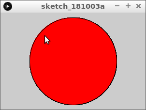
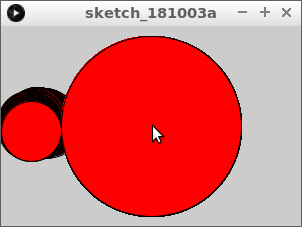
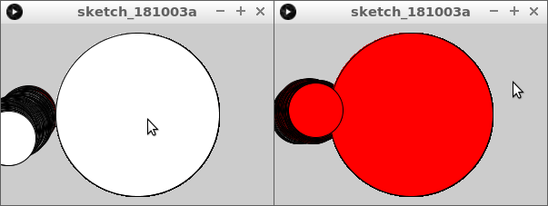
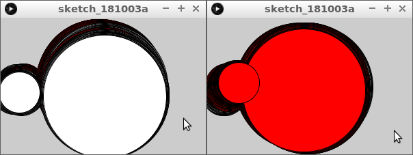

# 31. Cirklar krockar

I den här lektionen ska vi lära oss hur man mäter om två cirklar krockar.

\pagebreak

## 31.1. Cirklar krockar: uppgift 1

Skriv denna kod över:

```processing
float x1 = 150;
float y1 = 100;
float d1 = 180;
float r1 = d1 / 2;

void setup()
{
  size(300, 200);
}

void draw()
{
  fill(255, 255, 255);
  if (dist(mouseX, mouseY, x1, y1) < r1)
  {
    fill(255, 0, 0);  
  }
  ellipse(x1, y1, d1, d1);  
}
```

Vad ser du?

\pagebreak

## 31.2. Cirklar krockar: lösning 1

En cirkel. När du flyttar muspekaren in i den blir den röd.



\pagebreak

## 31.3. Cirklar krockar: uppgift 2

Lägg till en andra cirkel.
Skapa fyra nya variabler:

```
float x2 = 30;
float y2 = 100;
float d2 = 60;
float r2 = d2 / 2;
```

Rita en andra cirkel centrerad på `(x2, y2)` och bredd en
höjd `d2`.

\pagebreak

## 31.4. Cirklar krockar: lösning 2

```processing
// ...
float x2 = 30;
float y2 = 100;
float d2 = 60;
float r2 = d2 / 2;

void setup()
{
  size(300, 200);
}

void draw()
{
  // ...
  ellipse(x2, y2, d2, d2);  
}
```

Vad ser du?

\pagebreak

## 31.5. Cirklar krockar: uppgift 3

Lägg till i `draw`-funktionen:

```processing
x2 = x2 + random(-1, 1);
y2 = y2 + random(-1, 1);
```

Vad ser du?

\pagebreak

## 31.6. Cirklar krockar: lösning 3

Du kommer att se den lilla cirkeln röra sig.



\pagebreak

## 31.7. Cirklar krockar: uppgift 4

Ändra `if`-satsen till `draw`-funktionen till:

```processing
  if (dist(x1, y1, x2, y2) < r1 + r2)
  {
    fill(255, 0, 0);  
  }
```

Vad ser du?

## 31.8. Cirklar krockar: lösning 4

Du kan se cirklarna bli röda när de krockar:



## 31.9. Cirklar krockar: Slutuppgift

Få också den stora cirkeln att röra sig. Krockar de ska de bli röda.


