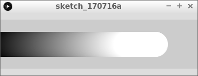
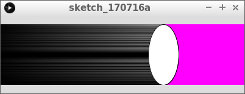

# `ellipse` och `background`

I den här lektionen kommer vi att lära oss hur man ritar ovaler.

Här kan du se ett känt spel, Bubble Bobble,
som fungerar mycket med cirklar:


\pagebreak

## `ellipse` och `background`: uppgift 1

Kör den här koden

```c++
float x = -50;
float hastighet = 1;

void setup()
{
  size(400, 100);
}

void draw()
{
  stroke(x, x, x);
  fill(x, x, x);
  ellipse(x, height / 2, 50, 50);
  x = x + hastighet;
  if (x > width + 50)
  {
    x = -50;
  }
}
```

\pagebreak

## `ellipse` och `background`: lösning 1



\pagebreak

## `ellipse` och `background`: uppgift 2


Ändra det tredje och fjärde numret för ellipsen (100 -talet),
så att ovalen blir dubbelt så hög.

\pagebreak

## `ellipse` och `background`: lösning 2

```c++
float x = -50;
float hastighet = 1;

void setup()
{
  size(400, 100);
}

void draw()
{
  stroke(x, x, x);
  fill(x, x, x);
  ellipse(x, height / 2, 50, 100);
  x = x + hastighet;
  if (x > width + 50)
  {
    x = -50;
  }
}
```

\pagebreak

## `ellipse` och `background`: uppgift 3


Lägg till som den första raden i `draw`:

```c++
background(255, 0, 0);
```

\pagebreak

## `ellipse` och `background`: lösning 3

```c++
float x = -50;
float hastighet = 1;

void setup()
{
  size(400, 100);
}

void draw()
{
  background(255, 0, 0);
  stroke(x, x, x);
  fill(x, x, x);
  ellipse(x, height / 2, 50, 100);
  x = x + hastighet;
  if (x > width + 50)
  {
    x = -50;
  }
}
```

\pagebreak

## `ellipse` och `background`: uppgift 4


Gör nu bakgrunden magenta.
Gör kanten på cirkeln svart

\pagebreak

## `ellipse` och `background`: lösning 4

```
float x = -50;
float hastighet = 1;

void setup()
{
  size(400, 100);
}

void draw()
{
  background(255, 0, 255);
  stroke(0, 0, 0);
  fill(x, x, x);
  ellipse(x, height / 2, 50, 100);
  x = x + hastighet;
  if (x > width + 50)
  {
    x = -50;
  }
}
```

\pagebreak

## `ellipse` och `background`: uppgift 5

Lägg nu raden med `background` efter 'size' (inom `setup`).

\pagebreak

## `ellipse` och `background`: lösning 5



```c++
float x = -50;
float hastighet = 1;

void setup()
{
  size(400, 100);
  background(255, 0, 255);
}

void draw()
{
  stroke(0, 0, 0);
  fill(x, x, x);
  ellipse(x, height / 2, 50, 100);
  x = x + hastighet;
  if (x > width + 50)
  {
    x = -50;
  }
}
```

\pagebreak

## `ellipse` och `background`: uppgift 6


Gör linjefärgen på ovalen valfri färg: den röda, gröna och
blått värde måste alla vara slumpmässigt.

\pagebreak

## `ellipse` och `background`: lösning 6

```c++
float x = -50;
float hastighet = 1;

void setup()
{
  size(400, 100);
  background(255, 0, 255);
}

void draw()
{
  stroke(random(256), random(256), random(256));
  fill(x, x, x);
  ellipse(x, height / 2, 50, 100);
  x = x + hastighet;
  if (x > width + 50)
  {
    x = -50;
  }
}
```

\pagebreak

## `ellipse` och `background`: sista uppgiftt


Gör den ovala rundan, samma höjd som skärmen, magenta och med en röd kant.
Bakgrunden ska vara orange (orange är helröd, halvfull grön och ingen blå).
Det ska inte finnas någon sträng från gamla ovaler.
