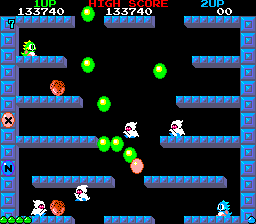
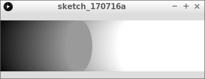
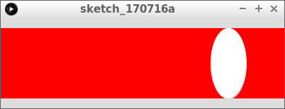
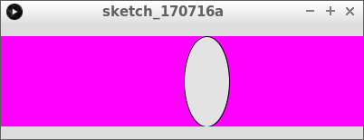
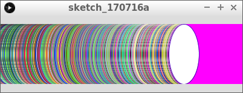

# `ellipse` och `background`

Under den här lektionen kommer vi att lära oss hur man ritar ovaler, dvs ellipser.

Här kan du se ett känt spel, Bubble Bobble,
som använder mycket ovaler:



\pagebreak

## `ellipse` och `background`: uppgift 1

Kör den här koden

```c++
float x = -50;
float hastighet = 1;

void setup()
{
  size(400, 100);
}

void draw()
{
  stroke(x, x, x);
  fill(x, x, x);
  ellipse(x, height / 2, 50, 50);
  x = x + hastighet;
  if (x > width + 50)
  {
    x = -50;
  }
}
```

\pagebreak

## `ellipse` och `background`: lösning 1


\pagebreak

## `ellipse` och `background`: uppgift 2



Ändra det fjärde talet för ellipsen (50-talet),
så att ovalen blir dubbelt så hög.

\pagebreak

## `ellipse` och `background`: lösning 2

```c++
float x = -50;
float hastighet = 1;

void setup()
{
  size(400, 100);
}

void draw()
{
  stroke(x, x, x);
  fill(x, x, x);
  ellipse(x, height / 2, 50, 100);
  x = x + hastighet;
  if (x > width + 50)
  {
    x = -50;
  }
}
```

\pagebreak

## `ellipse` och `background`: uppgift 3



Lägg till nedanstående rad som första rad i funktionen `draw`:

```c++
background(255, 0, 0);
```

\pagebreak

## `ellipse` och `background`: lösning 3

```c++
float x = -50;
float hastighet = 1;

void setup()
{
  size(400, 100);
}

void draw()
{
  background(255, 0, 0);
  stroke(x, x, x);
  fill(x, x, x);
  ellipse(x, height / 2, 50, 100);
  x = x + hastighet;
  if (x > width + 50)
  {
    x = -50;
  }
}
```

\pagebreak

## `ellipse` och `background`: uppgift 4



Gör nu bakgrunden magentafärgad (rosa).
Gör kanten på cirkeln svart.

\pagebreak

## `ellipse` och `background`: lösning 4

```
float x = -50;
float hastighet = 1;

void setup()
{
  size(400, 100);
}

void draw()
{
  background(255, 0, 255);
  stroke(0, 0, 0);
  fill(x, x, x);
  ellipse(x, height / 2, 50, 100);
  x = x + hastighet;
  if (x > width + 50)
  {
    x = -50;
  }
}
```

\pagebreak

## `ellipse` och `background`: uppgift 5

Lägg nu raden med `background` efter 'size' (inom `setup`).

\pagebreak

## `ellipse` och `background`: lösning 5


```c++
float x = -50;
float hastighet = 1;

void setup()
{
  size(400, 100);
  background(255, 0, 255);
}

void draw()
{
  stroke(0, 0, 0);
  fill(x, x, x);
  ellipse(x, height / 2, 50, 100);
  x = x + hastighet;
  if (x > width + 50)
  {
    x = -50;
  }
}
```

\pagebreak

## `ellipse` och `background`: uppgift 6



Gör så att linjefärgen på ovalen får slumpmässiga färger: alltså att värdet på det röda, gröna och
blåa ändrar sig slumpmässigt.

\pagebreak

## `ellipse` och `background`: lösning 6

```c++
float x = -50;
float hastighet = 1;

void setup()
{
  size(400, 100);
  background(255, 0, 255);
}

void draw()
{
  stroke(random(256), random(256), random(256));
  fill(x, x, x);
  ellipse(x, height / 2, 50, 100);
  x = x + hastighet;
  if (x > width + 50)
  {
    x = -50;
  }
}
```

\pagebreak

## `ellipse` och `background`: sista uppgiftt


Gör nu ovalen helt rund, med samma höjd som fönstret, magentafärgad och med en röd kant.
Bakgrunden ska vara orange (orange är helt rött, halvt grönt och inget blått).
Och det får inte finnas några utritade spår efter gamla ovaler, bara den nya ska synas.
