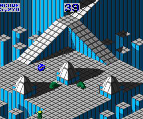
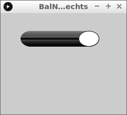
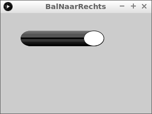
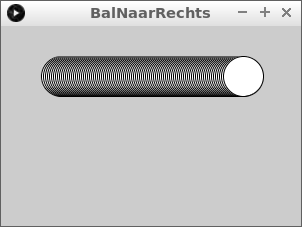
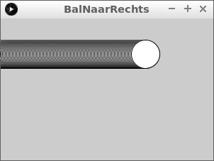
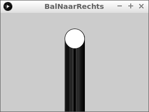

# Låt bollen åka åt höger

Under den här lektionen ska vi låta en boll åka åt höger.

Du kommer också att lära dig vad en variabel är.
Man kan knappt programmera utan variabler.



\pagebreak
  
## Låt bollen åka åt höger: intro

Skriv följande kod:

```c++
float x = 60;

void setup()
{
  size(250, 200);
}

void draw()
{
  ellipse(x, 50, 40, 30);
  x = x + 1;
}
```

Tryck sedan på 'Run'.

Om det finns röda bokstäver har du stavat fel någonstans. 
Titta noga på koden och rätta dina stavfel.

Om allt går bra ser du en boll som rör sig till höger (se figur `Flytta bollen till höger: intro`).



\pagebreak

\pagebreak

\pagebreak

## Låt bollen åka åt höger: uppgift 1



Skärmen är nu `250` pixlar bred. Nu ska du göra den `300` pixlar bred.

Ändra koden och tryck på "Run".

\pagebreak

## Låt bollen åka åt höger: lösning 1

Det står `250` i koden på ett ställe. Bara ändra detta till `300`:

```c++
float x = 60;

void setup()
{
  size(300, 200);
}

void draw()
{
  ellipse(x, 50, 40, 30);
  x = x + 1;
}
```

 | 
:-----------------:|:-----------------------------:
`size(300, 200);`  | 'Kära dator, skapa ett fönster som är 300 pixlar brett och 200 pixlar högt.'

\pagebreak

\pagebreak

## Låt bollen åka åt höger: uppgift 2


Bollen är nu äggformad: den är `40` pixlar bred och `30` pixlar hög.
Nu ska du göra bollen rund: `40` pixlar bred och `40` pixlar hög.

\pagebreak

## Låt bollen åka åt höger: lösning 2

`ellips (x, 50, 40, 30);` ritar ut bollen.
`40, 30` gör bollen äggformad.
Att ändra koden till `40, 40` gör bollen rund.

```c++
float x = 60;

void setup()
{
  size(300, 200);
}

void draw()
{
  ellipse(x, 50, 40, 40);
  x = x + 1;
}
```

 | 
:----------------------:|:--------------------------------------:
`ellips (x, 50,40,30);` | 'Kära dator, rita ut en oval som ligger `x` pixlar till höger och `50` pixlar nedåt, och är `40` pixlar bred och `30` pixlar hög.'

\pagebreak

## Låt bollen åka åt höger: uppgift 3



Bollen rör sig nu åt höger med en hastighet på `1` pixel i taget.
Låt bollen röra sig till höger dubbelt så snabbt

\pagebreak

## Låt bollen åka åt höger: lösning 3

`x = x + 1;` flyttar bollen 1 pixel. Ändra detta till `x = x + 2;`. 
Koden blir då:

```c++
float x = 60;

void setup()
{
  size(300, 200);
}

void draw()
{
  ellipse(x, 50, 40, 40);
  x = x + 2;
}
```

 | 
:-----------------:|:-----------------------------:
`x = x + 1;`| 'Kära dator, öka `x` med 1.'
`x += 1;`   | 'Kära dator, öka `x` med 1.'
`x++;`      | 'Kära dator, öka `x`.'
`++x;`      | 'Kära dator, öka `x`.'

\pagebreak

## Låt bollen åka åt höger: uppgift 4



I början är bollens mitt `60` pixlar till höger.
Kan du få cirkeln att ritas ut `0` pixlar till höger?

\pagebreak

## Låt bollen åka åt höger: lösning 4

`float x = 60;` bestämmer mitten på bollen. 
Ändra detta till `float x = 0;`. 
Koden blir då:

```c++
float x = 0;

void setup()
{
  size(300, 200);
}

void draw()
{
  ellipse(x, 50, 40, 40);
  x = x + 2;
}
```

 | 
:------------------:|:--------------------------------:
`void setup() {}` | 'Kära dator, gör vad som helst inom måsvingarna.'

\pagebreak

## Låt bollen åka åt höger: uppgift 5

Haha, den här lektionen kallas 'Låt bollen åka åt höger', 
men nu ska vi också göra en boll som åker åt vänster!


Låt nu bollen börja på höger sida av fönstret och åka åt vänster.

\pagebreak

## Låt bollen åka åt höger: lösning 5

För att få bollen att starta på höger sida måste du använda `float x = 500;` 
(eller något annat högt tal).
För att få bollen att åka åt vänster måste du använda `x = x - 1;`. 
Koden blir då:

```c++
float x = 200;

void setup()
{
  size(300, 200);
}

void draw()
{
  ellipse(x, 50, 40, 40);
  x = x - 1;
}
```

 | 
:------------------:|:--------------------------------:
`void draw() {}` | 'Kära dator, gör vad som helst inom måsvingarna hela tiden.'

\pagebreak

## Låt bollen åka åt höger: vad är en variabel?

På den första raden använder vi en variabel:

```c++
float x = 50;
```

I klartext betyder det: "Kära dator, 
kom ihåg talet `x` med ett startvärde på `50`.".

 | 
:-------------------:|:--------------------------------:
`float x = 50;` | 'Kära dator, kom ihåg talet `x` med ett startvärde på `50`.'

En variabel är en plats i datorminnet med ett namn.
Datorn kan använda det namnet för att avgöra var i minnet den ska leta.
  
Variabler som tillhör dig (och nästan varje människa) är: namn, ålder,
födelsedatum, adress, telefonnummer, epostadress och mycket mer.
Om någon frågar dig i din ålder vet du vilket nummer du ska svara.

 | 
:-------------------:|:--------------------------------:
`pengar` | 'Kära dator, berätta hur mycket pengar jag har på banken.'
`1000000` | 'Jättebra!'

\pagebreak

Tillbaka till den första raden i vår kod:

```c++
float x = 50;
```

Ordet `x` är namnet på en variabel. 
I det här fallet beskriver den hur långt till höger cirkeln är.
Ordet `float` betyder att `x` är ett (decimal) tal.
Symbolen `=` betyder 'ska nu vara'.
Talet `50` är det startvärdet.
Semikolon (`;`) anger slutet på en mening (som punkten i en svensk text).


 | 
:-------------------:|:--------------------------------:
`float` | 'ett tal'
`=`     | 'ska nu vara'
`;`     | 'sluten av meningen'

\pagebreak

## Låt bollen åka åt höger: uppgift 6

Haha, den här lektionen kallas "Låt bollen åka åt höger", 
men vi kommer också att få en boll att åka nedåt!


 * Ändra namnet på variabeln `x` till `y`
 * Rita ut en boll högst upp på skärmen
 * Bollen måste vara `150` pixlar till höger
 * Bollen måste åka ner i en rak linje. Tips: bollen är nu 50 pixlar nere

\pagebreak

## Låt bollen åka åt höger: lösning 6

```c++
float y = 0;

void setup()
{
  size(300, 200);
}

void draw()
{
  ellipse(150, y, 40, 40);
  y = y + 1;
}
```

\pagebreak

## Låt bollen åka åt höger: uppgift 7



Nu ska vi få bollen att röra sig snabbare och uppåt

 * Rita ut en boll längst ner på skärmen
 * Bollen måste åka uppåt i en rak linje
 * Bollen måste åka dubbelt så snabbt

\pagebreak

## Låt bollen åka åt höger: lösning 7

```c++
float y = 200;

void setup()
{
  size(300, 200);
}

void draw()
{
  ellipse(150, y, 40, 40);
  y = y - 1;
}
```

\pagebreak

## Låt bollen åka åt höger: slutuppgift


 * bollen måste åka diagonalt åt höger och neråt samtidigt
 * bollen måste bli större, det vill säga öka bredd och höjd
 * se även figur `slutuppgift 'Låt bollen åka åt höger'`

