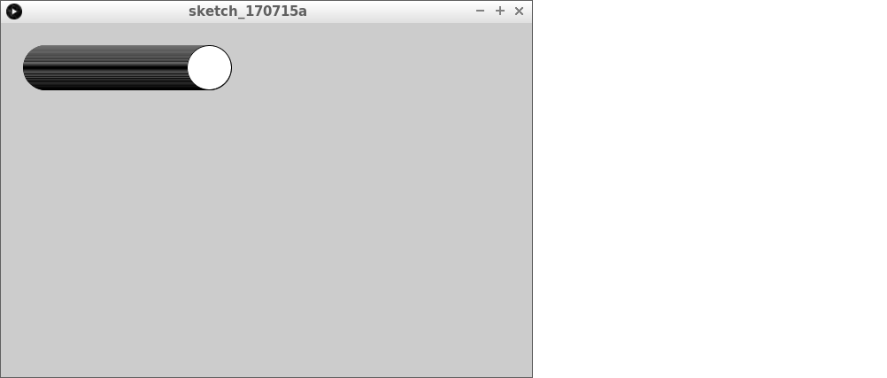
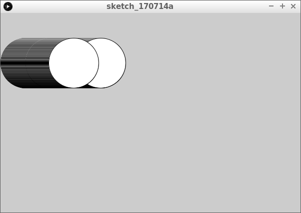
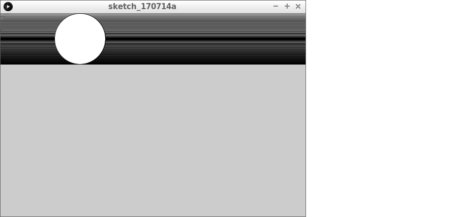
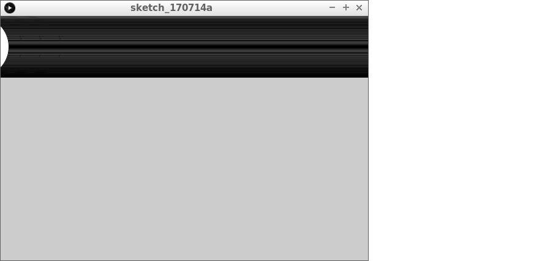
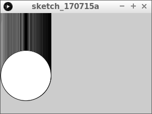
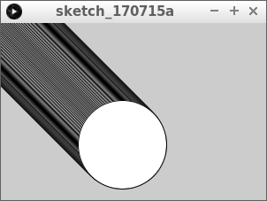
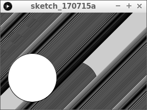

# Låt bollen åka åt höger i all evighet

Under den här lektionen ska vi få en boll att åka åt höger i all evighet.

Under den här lektionen lär vi oss också vad en `if`-sats är.
Du kan (nästan) inte programmera utan `if`-satser.


\pagebreak

## Låt bollen åka åt höger i all evighet: intro



Detta är en boll som åker åt höger:

```c++
float x = 50;

void setup()
{
  size(600, 400);
}

void draw()
{
  ellipse(x, 50, 50, 50);
  x = x + 1;
}
```

Nackdel: bollen återvänder aldrig till fönstret.

\pagebreak

Vi vill kunna säga, "Kära dator, **om** bollen är för långt bort åt höger,
ska du teleportera bollen till vänster'. `if` är engelska för 'om'.

Så det här kan bli:

```c++
if (x > 200)
{
  x = 100;
}
```

Tecknet `>` betyder 'större än'. 
Mer exakt blir det: "Kära dator, **om** `x` är större än `200`, 
sätt `x` till `100`. `if` är engelska för 'om'.


 | 
:-----------------:|:-----------------------------:
`if(x> 200) {}` | 'Kära dator, om `x` är större än `200`, gör det som står inom måsvingarna.'
`x = 100;` | 'Kära dator, låt `x` vara `100`.'

\pagebreak

## Låt bollen åka åt höger i all evighet: uppgift 1



Skriv `if` inuti programmets kod. 
Skriv `if` i slutet av `draw`, före den avslutande måsvingen (`}`).

\pagebreak

## Låt bollen åka åt höger i all evighet: lösning 1

Koden blir då:

```c++
float x = 50;

void setup()
{
  size(600, 400);
}

void draw()
{
  ellipse(x,100,100,100);
  x = x + 1;
  if (x > 200)
  {
    x = 100;
  }
}
```

\pagebreak

## Låt bollen åka åt höger i all evighet: uppgift 2


Se till att bollen startar allra längst till vänster i fönstret

\pagebreak

## Låt bollen åka åt höger i all evighet: lösning 2

 * Ändra `float x = 50` till `float x = 0` eller `float x = -50`: båda är bra.
 * Ändra `x = 100` till `x = 0` eller `x = -50`: båda är bra.

```c++
float x = 50;

void setup()
{
  size(600, 400);
}

void draw()
{
  ellipse(x,100,100,100);
  x = x + 1;
  if (x > 200)
  {
    x = 0;
  }
}
```

\pagebreak

## Låt bollen åka åt höger i all evighet: uppgift 3



Se till att bollen åker hela vägen till höger 
innan den hoppar till vänster sida av fönstret

\pagebreak

## Låt bollen åka åt höger i all evighet: lösning 3

Ändra `if (x > 200)` till `if (x > 650)`.

```c++
float x = -50;

void setup()
{
  size(600, 400);
}

void draw()
{
  ellipse(x,50,100,100);
  x = x + 1;
  if (x > 650)
  {
    x = 0;
  }
}
```

\pagebreak

## Låt bollen åka åt höger i all evighet: uppgift 4

Lurad! 
Även om lektionen heter 'Låt bollen åka åt höger i all evighet', 
så ska nu bollen byta håll.

Vi ska nu programmera en boll som åker åt vänster i all evighet.

Det du behöver titta på nu är `if`-uttalandet för att kunna avgöra när `x` är för litet:

```c++
if (x < 100)
{
  x = 500;
}
```

Med detta säger du: 'Kära dator, om `x` är mindre än (`<`) hundra,
sätt `x` till femhundra istället'.

 | 
:-----------------:|:-----------------------------:
`om (x <100) {}` | 'Kära dator, om' x 'är mindre än 100, gör det som står innanför måsvingarna.'



Gör en boll som åker åt vänster i all evighet:

 * Bollen startar utanför fönstret
 * Bollen åker helt utanför fönstret
 * Om bollen åker utanför fönstret ska den omedelbart börja om igen på andra sidan

\pagebreak

## Låt bollen åka åt höger i all evighet: lösning 4

Detta är en evighetsboll som åker åt vänster:

```c++
float x = 650;

void setup()
{
  size(600, 400);
}

void draw()
{
  ellipse(x, 50, 100, 100);
  x = x - 1;
  if (x < -50)
  {
    x = 650;
  }
}
```

 | 
:-----------------:|:-----------------------------:
`x = x - 1` | 'Kära dator, minska `x` med ett.'
`x -= 1` | 'Kära dator, minska `x` med ett.'
`x-` | 'Kära dator, minska `x` med ett.'
`--x` | 'Kära dator, minska `x` med ett.'

\pagebreak

## Låt bollen åka åt höger i all evighet: uppgift 5

Vi fick en boll att åka åt höger och åt vänster när vi ändrade koordinaten `x`. 
Bollen kan också åka neråt och uppåt om vi ändrar y-koordinaten.



Skriv ett program där en boll åker neråt i all evighet:

 * gör skärmen 300 pixlar bred och 200 pixlar hög
 * använd en variabel som heter 'y'
 * ersätt koden `ellips (x, 50, 100, 100)` med `ellipse (50, y, 100, 100)`
 * om bollen åker neråt och utanför fönstret så måste bollen börja om uppifrån igen

\pagebreak

## Låt bollen åka åt höger i all evighet: lösning 5

```c++
float y = -50;

void setup()
{
  size(300, 200);
}

void draw()
{
  ellipse(50,y,100,100);
  y = y + 1;
  if (y > 250)
  {
    y = -50;
  }
}
```

\pagebreak

## Låt bollen åka åt höger i all evighet: uppgift 6

Oj, nu när vi har skapat en variabel `x` och en variabel `y`, låt oss använda båda samtidigt!

När vi slår ihop kod gäller följande regler:

 * allt som finns ovanför `setup` -funktionen ska vara kvar där
 * allt som finns inuti `setup`-funktionen måste vara kvar inuti `setup`-funktionen
 * allt som finns inuti funktionen `draw` måste vara kvar inuti funktionen `draw`



 * Slå ihop koden för "Låt bollen åka åt höger i all evighet" med "Låt bollen åka åt neråt i all evighet"
 * Ändra koden så att bollen åker neråt

\pagebreak

## Låt bollen åka åt höger i all evighet: lösning 6

```c++
float x = -50;
float y = -50;

void setup()
{
  size(300, 200);
}

void draw()
{
  ellipse(x,y,100,100);
  x = x + 1;
  y = y + 1;
  if (x > 350)
  {
    x = -50;
  }
  if (y > 250)
  {
    y = -50;
  }
}
```

\pagebreak

## Låt bollen åka åt höger i all evighet: slutuppgift



Låt nu bollen åka snett neråt vänster i all evighet.


