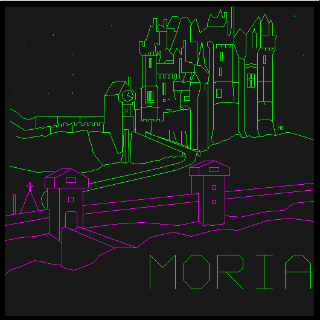
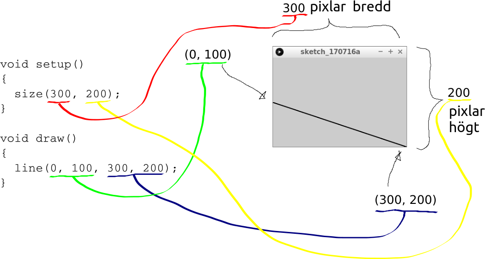
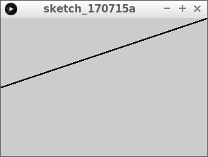
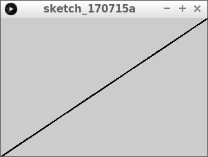
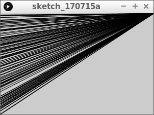
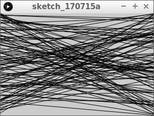
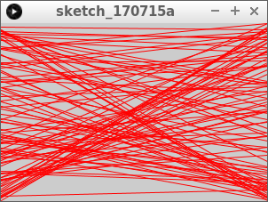
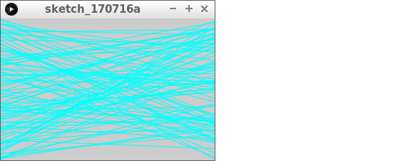
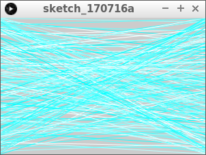

# `line` och `stroke`



I den här lektionen kommer vi att lära oss att rita färgade linjer.

\pagebreak

## `line` och `stroke`: uppgift 1

Kör den här koden:

```c++
void setup()
{
  size(300, 200);
}

void draw()
{
  line(0, 100, 300, 200);
}
```

 | 
:-----:|:--------------------------------------------:
`rad (0, 100, 300, 200);` | 'Kära dator, dra en linje från `(0, 100)` till `(300, 200)`.'

 | `(100, 200)` är pixeln som sitter `100` pixlar till vänster och `200` pixlar under fönstrets vänstra hörn
:-----------------:|:-----------------------------:

\pagebreak

## `line` och `stroke`: lösning 1



\pagebreak

## `line` och `stroke`: uppgift 2



Ändra linjen så att den går till det övre högra hörnet,
i ställe åt till den nedre högra hörnet.

\pagebreak

## `line` och `stroke`: lösning 2

```c++
void setup()
{
  size(300, 200);
}

void draw()
{
  line(0, 100, 300, 0);
}
```

\pagebreak

## `line` och `stroke`: uppgift 3


Ändra linjen så att den börjar längst ner till vänster,
i ställe åt vänster i mitten.


\pagebreak

## `line` och `stroke`: lösning 3

```c++
void setup()
{
  size(300, 200);
}

void draw()
{
  line(0, 200, 300, 0);
}
```

\pagebreak

## `line` och `stroke`: uppgift 4

Låt linjen gå från nedre vänster till överst till höger, 
men använd nu `width` och `height` istället.



\pagebreak

## `line` och `stroke`: lösning 4

```c++
void setup()
{
  size(300, 200);
}

void draw()
{
  line(0, height, width, 0);
}
```

\pagebreak

## `line` och `stroke`: uppgift 5



Starta linjen till vänster på en slumpmässig höjd. 
Du gör detta med `random`.

\pagebreak

## `line` och `stroke`: lösning 5

```c++
void setup()
{
  size(300, 200);
}

void draw()
{
  line(0, random(height), width, 0);
}
```

\pagebreak

## `line` och `stroke`: uppgift 6



Låt linjen nu också sluta till höger på en slumpmässig höjd.

\pagebreak

## `line` och `stroke`: lösning 6

```c++
void setup()
{
  size(300, 200);
}

void draw()
{
  line(0, random(height), width, random(height));
}
```

\pagebreak

## `line` och `stroke`: uppgift 7



Före meningen med `line`, skriv linjen `stroke(255, 0, 0);`.

\pagebreak

## `line` och `stroke`: lösning 7

```c++
void setup()
{
  size(300, 200);
}

void draw()
{
  stroke(255, 0, 0);
  line(0, random(height), width, random(height));
}
```

 | 
:-----:|:--------------------------------------------:
`stroke (255, 0, 0);` | 'Kära dator, färga linjerna röda.'
`stroke (255, 0, 0);` | 'Kära dator, färga linjerna fullt röda, utan grönt och utan blått.'

\pagebreak

## `line` och `stroke`: uppgift 8



Gör linjerna cyan nu. Titta på figuren 'Färgcirkel' hur du gör det


\pagebreak

## `line` och `stroke`: lösning 8

```c++
void setup()
{
  size(300, 200);
}

void draw()
{
  stroke(0, 255, 255);
  line(0, random(height), width, random(height));
}
```

 | 
:-----:|:--------------------------------------------:
`stroke (0, 255, 255);` | 'Kära dator, färga linjerna cyan.'
`stroke (0, 255, 255);` | 'Kära dator, färga linjerna utan rött, fullt grönt och helt blått.'

\pagebreak

## `line` och `stroke`: uppgift 9



Låt nu det rödvärdet bli en slumpmässig tal från 0 till 256.

\pagebreak

## `line` och `stroke`: lösning 9

```c++
void setup()
{
  size(300, 200);
}

void draw()
{
  stroke(random(256), 255, 255);
  line(0, random(height), width, random(height));
}
```

\pagebreak

## `line` och `stroke`: slutuppgift


Låt nu linjer börja och sluta på slumpmässiga platser. 
Linjefärgen måste var också slumpmässig.

