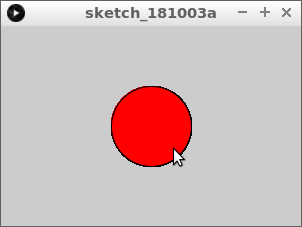

# 30. Muspekare i cirkel

I den här lektionen ska vi lära oss hur man ser om muspekaren är inuti en cirkel

\pagebreak

## 30.1. Muspekare i cirkel: uppgift 1

Skriv denna kod över:

```processing
void setup()
{
  size(300, 200);
}

void draw()
{
  fill(255, 255, 255);
  if (dist(mouseX, mouseY, 150, 100) < 40)
  {
    fill(255, 0, 0);  
  }
  ellipse(150, 100, 80, 80);  
}
```

Vad ser du? När blir cirkeln röd?

\pagebreak

## 30.2. Muspekare i cirkel: lösning 1

Cirkeln blir röd när du flyttar muspekaren
rör sig i cirkeln.



\pagebreak

## 30.3. Muspekare i cirkel: uppgift 2

Skapa en variabel: `float cirkel_mitten_x = 150;`.
Ersätt de andra `150`erna i koden med `cirkel_mitten_x`.

\pagebreak

## 30.4. Muspekare i cirkel: lösning 2

```processing
float cirkel_mitten_x = 150;

void setup()
{
  size(300, 200);
}

void draw()
{
  fill(255, 255, 255);
  if (dist(mouseX, mouseY, cirkel_mitten_x, 100) < 40)
  {
    fill(255, 0, 0);  
  }
  ellipse(cirkel_mitten_x, 100, 80, 80);  
}
```

\pagebreak

## 30.5. Muspekare i cirkel: uppgift 3

Lägg till följande rad i `setup`-funktionen:

```processing
cirkel_mitten_x = random(width);
```

Vad ser du? Kör programmet flera gånger!

\pagebreak

## 30.6. Muspekare i cirkel: lösning 3

```processing
float cirkel_mitten_x = 150;

void setup()
{
  size(300, 200);
  cirkel_mitten_x = random(width);
}

void draw()
{
  fill(255, 255, 255);
  if (dist(mouseX, mouseY, cirkel_mitten_x, 100) < 40)
  {
    fill(255, 0, 0);  
  }
  ellipse(cirkel_mitten_x, 100, 80, 80);  
}
```

\pagebreak

## 30.7. Muspekare i cirkel: uppgift 4

Skapa en ny variabel: `cirkel_mitten_y`.
I `setup` får den ett slumpmässigt tal upp till `höjd`.
`cirkel_mitten_y` ersätter `100`s.

## Muspekare i cirkel: lösning 4

```processing
float cirkel_mitten_x = 150;
float cirkel_mitten_y = 100;

void setup()
{
  size(300, 200);
  cirkel_mitten_x = random(width);
  cirkel_mitten_y = random(height);
}

void draw()
{
  fill(255, 255, 255);
  if (dist(mouseX, mouseY, cirkel_mitten_x, cirkel_mitten_y) < 40)
  {
    fill(255, 0, 0);  
  }
  ellipse(cirkel_mitten_x, cirkel_mitten_y, 80, 80);  
}
```

\pagebreak

## 30.8. Muspekare i cirkel: uppgift 5

Skapa en ny variabel: `circle_diameter`.
I `setup` får den ett slumpmässigt tal upp till `150`.
`cirkelsektion` ersätter `80-talet.

Vad är det som går fel?

## Muspekare i cirkel: lösning 5

```processing
float cirkel_mitten_x = 150;
float cirkel_mitten_y = 100;
float cirkel_diameter = 100;

void setup()
{
  size(300, 200);
  cirkel_mitten_x = random(width);
  cirkel_mitten_y = random(height);
  cirkel_diameter = random(150);
}

void draw()
{
  fill(255, 255, 255);
  if (dist(mouseX, mouseY, cirkel_mitten_x, cirkel_mitten_y) < 40)
  {
    fill(255, 0, 0);  
  }
  ellipse(
    cirkel_mitten_x, cirkel_mitten_y,
    cirkel_diameter, cirkel_diameter
  );  
}
```

\pagebreak

## 30.9. Muspekare i cirkel: slutppgift

Skapa en ny variabel: `cirkel_radius`.
I `setup` blir detta `circle_diameter / 2`.
`cirkel_radius` ersätter `40`s.
