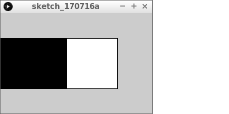
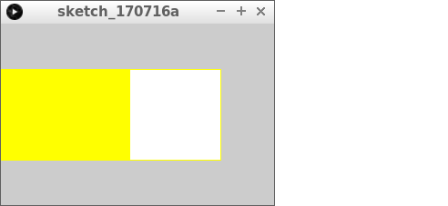
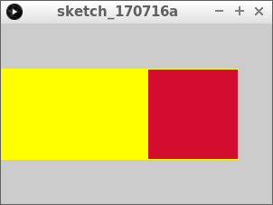

# `rect` och `fill`

Här ser du en av de berömdaste spel någonsin:


Du kan göra en fyrkant med fyra linjer,
men `rect` funkar lättare.

\pagebreak

## `rect` en `fill`: uppgift 1

Kör denna kod.

```c++
float x = -50;

void setup()
{
  size(300, 200);
}

void draw()
{
  ellipse(x, height / 2, 100, 100);
  x = x + 1;
  if (x > width + 50)
  {
    x = -50;
  }
}
```

\pagebreak

## `rect` en `fill`: lösning 1


\pagebreak

## `rect` en `fill`: uppgift 2

Lägg till följanderegel, efter `ellipse(x, height / 2, 100, 100);`:

```c++
  rect(x, height / 2, 100, 100);
```

 | 
:------------------------:|:---------------------------------------------------:
`rect (100, 200, 300, 400)` | 'Kära dator, rita ut en fyrkant med vänster-uppe-hörn på `(100, 200)`, 300 pixlar bredd upp och 400 pixlar högt.'

\pagebreak

## `rect` en `fill`: lösning 2


```c++
float x = -50;

void setup()
{
  size(300, 200);
}

void draw()
{
  ellipse(x, height / 2, 100, 100);
  rect(x, height / 2, 100, 100);
  x = x + 1;
  if (x > width + 50)
  {
    x = -50;
  }
}
```

\pagebreak

## `rect` en `fill`: uppgift 3



Rita upp fyrkanten över bollen.
Göra det på att mindre 50 av båda `x` och `y` coordinaterna.

\pagebreak

## `rect` en `fill`: lösning 3

```c++
float x = -50;

void setup()
{
  size(300, 200);
}

void draw()
{
  ellipse(x, height / 2, 100, 100);
  rect(x - 50, height / 2 - 50, 100, 100);
  x = x + 1;
  if (x > width + 50)
  {
    x = -50;
  }
}
```

\pagebreak

## `rect` en `fill`: uppgift 4



Ta bort nu den osyndbaren bollen.
På detta plats, använder `stroke` igen, men nu med färgen gul.
Kolla på färgenbollen nere:


\pagebreak

## `rect` en `fill`: lösning 4

```c++
float x = -50;

void setup()
{
  size(300, 200);
}

void draw()
{
  stroke(255, 255, 0);
  rect(x - 50, height / 2 - 50, 100, 100);
  x = x + 1;
  if (x > width + 50)
  {
    x = -50;
  }
}
```

\pagebreak

## `rect` en `fill`: uppgift 5

Lägg till följande meningen efter `stroke(255, 255, 0);`:

```c++
fill(x, 0, 255);
```

\pagebreak

## `rect` en `fill`: lösning 5


```c++
float x = -50;

void setup()
{
  size(300, 200);
}

void draw()
{
  stroke(255, 255, 0);
  fill(x, 0, 255);
  rect(x - 50, height / 2 - 50, 100, 100);
  x = x + 1;
  om (x> bredd + 50)
  {
    x = -50;
  }
}
```

 | 
:----------------:|:----------------------------------------:
`fill(0, 128, 255);` | 'Kära dator, gör fylfärg utan rood, halvgrön och helt blå.'

\pagebreak

## `rect` en `fill`: uppgift 6

Gör en ny variabel som heter `groen` (datorn älskar inte ord met `ö`).
`groen` skulla ha en startvärde av nul.
`groen` används som den andra tal i `fill` (som är platsen efter `0`).
Varje gång blir `groen` två hoger.

\pagebreak

### `rect` en `fill`: lösning 6

```c++
float x = -50;
float groen = 0;

void setup()
{
  size(300, 200);
}

void draw()
{
  stroke(255, 255, 0);
  fill(x, groen, 255);
  rect(x - 50, height / 2 - 50, 100, 100);
  x = x + 1;
  groen = groen + 2;
  if (x > width + 50)
  {
    x = -50;
  }
}
```
 
\pagebreak

## `rect` en `fill`: uppgift 7


De variabla `groen` kan inte bli högre än `255`. Gör en ny `if`-sats,
för att om `groen` är mer än 255, `groen` ska bli nul.

\pagebreak

## `rect` en `fill`: lösning 7

```c++
float x = -50;
float groen = 0;

void setup()
{
  size(300, 200);
}

void draw()
{
  stroke(255, 255, 0);
  fill(x, groen, 255);
  rect(x - 50, height / 2 - 50, 100, 100);
  x = x + 1;
  groen = groen + 2;
  if (x > width + 50)
  {
    x = -50;
  }
  if (groen > 255)
  {
    groen = 0;
  }
}
```

\pagebreak

## `rect` en `fill`: uppgift 8



Fylfärge skulla nu ha en blåvärde
som är en slumpmässig tal mellan 0 och 256.

\pagebreak

## `rect` en `fill`: lösning 8

```c++
float x = -50;
float groen = 0;

void setup()
{
  size(300, 200);
}

void draw()
{
  stroke(255, 255, 0);
  fill(x, groen, random(256));
  rect(x - 50, height / 2 - 50, 100, 100);
  x = x + 1;
  groen = groen + 2;
  if (x > width + 50)
  {
    x = -50;
  }
  if (groen > 255)
  {
    groen = 0;
  }
}
```

\pagebreak

## `rect` en `fill`: slutuppgift


Nu ska du ändra båda linjefärg och fylfärg.
Linjefärg ska bli röt, men rötvärde är slumpmässig mellen 0 och 256.
Fyllfarg ska blu grönt, och växnar från 0 till 256 i stegor av 3.
Om gröntvärd är större som 256, måsta den bli 0 igen.

