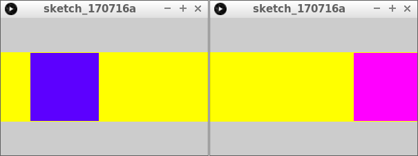
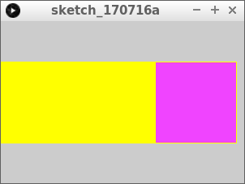

# `rect` en `fill`

Används ofta i spel.

Här ser du en av de berömdaste spel någonsin:


Du kan en fyrkantig text med fyra linjer,
maar de `rect` funktion fungerar lättelijker.

\pagebreak

## `rect` en `fill`: uppgift 1

Kör denna kod

```c++
float x = -50;

void setup()
{
  size(300, 200);
}

void draw()
{
  ellipse(x, height / 2, 100, 100);
  x = x + 1;
  if (x > width + 50)
  {
    x = -50;
  }
}
```

\pagebreak

## `rect` en `fill`: lösning 1


\pagebreak

## `rect` en `fill`: uppgift 2

Lägg till följande extra regel toe, efter `ellipse (x, height / 2, 100, 100);`:

```c++
  rect(x, height / 2, 100, 100);
```

 | 
:------------------------:|:---------------------------------------------------:
`rect (100, 200, 300, 400)` | 'Lieve computer, teken een rechthoek met' (100, 200) 'som linkerbovenhoek, 300 pixlar föder upp och 400 pixlar hög är. '

\pagebreak

## `rect` en `fill`: lösning 2


```c++
float x = -50;

void setup()
{
  size(300, 200);
}

void draw()
{
  ellipse(x, height / 2, 100, 100);
  rect(x, height / 2, 100, 100);
  x = x + 1;
  if (x > width + 50)
  {
    x = -50;
  }
}
```

\pagebreak

## `rect` en `fill`: uppgift 3


Teken de rechthoek nu over de ovaal. Doe dit door van de `x` en` y` coordinaat 50 af te halen.

\pagebreak

## `rect` en `fill`: lösning 3

```c++
float x = -50;

void setup()
{
  size(300, 200);
}

void draw()
{
  ellipse(x, height / 2, 100, 100);
  rect(x - 50, height / 2 - 50, 100, 100);
  x = x + 1;
  if (x > width + 50)
  {
    x = -50;
  }
}
```

\pagebreak

## `rect` en `fill`: uppgift 4


Haal de onzichttbare ovaal weg och gör linekleuren. Hur du gör det,
kun je see in figuur `Kleurencirkel`.


\pagebreak

## `rect` en `fill`: lösning 4

```c++
float x = -50;

void setup()
{
  size(300, 200);
}

void draw()
{
  stroke(255, 255, 0);
  rect(x - 50, height / 2 - 50, 100, 100);
  x = x + 1;
  if (x > width + 50)
  {
    x = -50;
  }
}
```

\pagebreak

## `rect` en `fill`: uppgift 5

Lägg till följande regel toe na `stroke (255, 255, 0);`:

```c++
fill(x, 0, 255);
```

\pagebreak

## `rect` en `fill`: lösning 5



```c++
float x = -50;

void setup()
{
  size(300, 200);
}

void draw()
{
  stroke(255, 255, 0);
  fill(x, 0, 255);
  rect(x - 50, height / 2 - 50, 100, 100);
  x = x + 1;
  om (x> bredd + 50)
  {
    x = -50;
  }
}
```

 | 
:----------------:|:----------------------------------------:
`fyllning (0, 128, 255);` | 'Lieve computer, gör invulkleur utan rood, halvolgrön och vol blauw.'

\pagebreak

## `rect` en `fill`: uppgift 6

Gör en ny variabel till, `grön` med en börjanvärde av nul.
`green` används som den andra getal van` fill` (plats av de nul).
Varje gång blir `grön` två hoger.

\pagebreak

### `rect` en `fill`: lösning 6

```c++
float x = -50;
float groen = 0;

void setup()
{
  size(300, 200);
}

void draw()
{
  stroke(255, 255, 0);
  fill(x, groen, 255);
  rect(x - 50, height / 2 - 50, 100, 100);
  x = x + 1;
  groen = groen + 2;
  if (x > width + 50)
  {
    x = -50;
  }
}
```
 
\pagebreak

## `rect` en `fill`: uppgift 7



De variabla `gröna` kan inte bli högre än` 255`. Gör en `om` erbij,
att som `grön` mer är dan 255, att den gröna sedan nul blir

\pagebreak

## `rect` en `fill`: lösning 7

```c++
float x = -50;
float groen = 0;

void setup()
{
  size(300, 200);
}

void draw()
{
  stroke(255, 255, 0);
  fill(x, groen, 255);
  rect(x - 50, height / 2 - 50, 100, 100);
  x = x + 1;
  groen = groen + 2;
  if (x > width + 50)
  {
    x = -50;
  }
  if (groen > 255)
  {
    groen = 0;
  }
}
```

\pagebreak

## `rect` en `fill`: uppgift 8


Skapa en blå färg av en uppvärmning som kommer från och med 256.

\pagebreak

## `rect` en `fill`: lösning 8

```c++
float x = -50;
float groen = 0;

void setup()
{
  size(300, 200);
}

void draw()
{
  stroke(255, 255, 0);
  fill(x, groen, random(256));
  rect(x - 50, height / 2 - 50, 100, 100);
  x = x + 1;
  groen = groen + 2;
  if (x > width + 50)
  {
    x = -50;
  }
  if (groen > 255)
  {
    groen = 0;
  }
}
```

\pagebreak

## `rect` en `fill`: eindopdracht


Skapa en rad kläder som kan användas i alla kategorier (från svart till röd, grön och blå är från).
Laat de invulkleur går från svart till grönt, där green steeds 3 blir.
