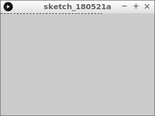
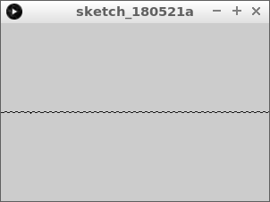
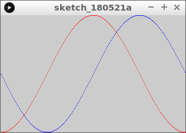

# Sinus och cosinus 1: graf

Under den här lektionen ska vi rita en sinus och en cosinus.


\pagebreak

## Sinus och Cosinus 1: uppgift 1

Skriv denna kod över:

```processing
float x = 0;

void setup()
{
  size(314, 200);
}

void draw()
{
  final float y = sin(x);
  point(x, y);
  x = x + 1;  
}
```

Vad ser du?

 | 314 är ungefär hundra gånger talet pi
:-----------------:|:--------------------------------------------:

\pagebreak

## Sinus och cosinus 1: lösning 1



Du kommer att se en sorts prickad linje längst upp.

\pagebreak

## Sinus och Cosinus 1: uppgift 2

 * Flytta den prickade linjen nedåt. Gör detta genom att lägga till halva höjden med `y`

 | Tips: det är smart att sätta parenteser runt `height / 2`
:-----------------:|:--------------------------------------------:



\pagebreak

## Sinus och cosinus 1: lösning 2

```processing
float x = 0;

void setup()
{
  size(314, 200);
}

void draw()
{
  final float y = sin(x) + (height / 2);
  point(x, y);
  x = x + 1;  
}
```

 | Fästena hjälper datorn att veta ordningen på en beräkning
:-----------------:|:-----------------------------:

 | En sinusvåg är formad som en våg som svänger mellan -1 och 1
:-----------------:|:--------------------------------------------:

\pagebreak

## Sinus och cosinus 1: uppgift 3

 * Ersätt `sin(x)` med `(sin(x) * 50)`


 | Parentes är viktigt!
:-----------------:|:--------------------------------------------:

\pagebreak

## Sinus och cosinus 1: lösning 3

Du kommer nu att se ett mönster.


```processing
float x = 0;

void setup()
{
  size(314, 200);
}

void draw()
{
  final float y = (sin(x) * 50) + (height / 2);
  point(x, y);
  x = x + 1;  
}
```

 | Det är en röra, eftersom vi blandar ungefär 100 bihålor
:-----------------:|:--------------------------------------------:

 | `*50` gör att sinus förstoras femtio gånger
:-----------------:|:--------------------------------------------:

## Sinus och cosinus 1: uppgift 4

 * Ersätt `sin(x)` med `sin(x / 100)`


\pagebreak

## Sinus och cosinus 1: lösning 4

Du ser nu en våg: en sinus!.


```processing
float x = 0;

void setup()
{
  size(314, 200);
}

void draw()
{
  final float y = (sin(x / 25) * 50) + (height / 2);
  point(x, y);
  x = x + 1;  
}
```

## Sinus och Cosinus 1: uppgift 5

 * Ersätt `sin(x)` med `cos(x)`


\pagebreak

## Sinus och cosinus 1: lösning 5

Du ser nu en våg: en sinus!.


```processing
float x = 0;

void setup()
{
  size(314, 200);
}

void draw()
{
  final float y = (sin(x / 25) * 50) + (height / 2);
  point(x, y);
  x = x + 1;  
}
```


 | `x / 25` ser till att vi går 25 gånger lugnare genom sinus
:-----------------:|:-----------------------------:

\pagebreak

## Sinus och cosinus 1: Slutuppgift

 * Rita både sinus och cosinus
 * Få varje våg att gå upp och ner en gång
 * Rita cosinus röd, sinus blå


