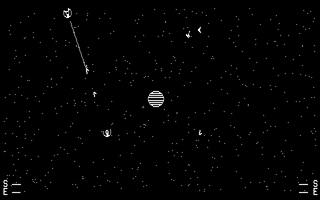
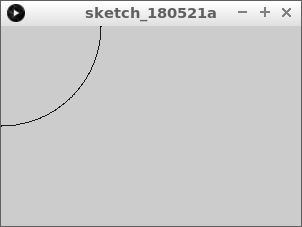
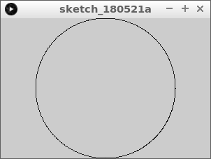
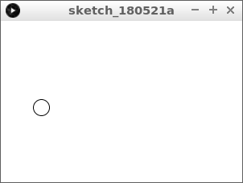
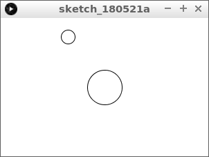

# Sinus och cosinus 2: rita

Under den här lektionen ska vi använda en sinus och cosinus 
för att få en måne att kretsa runt en planet.



\pagebreak

## Sinus och cosinus 2: uppgift 1

Skriv denna kod över:

```c++
float vinkel = 0;

void setup()
{
  size(300, 200);
}

void draw()
{
  final float x = cos(vinkel) * 100;
  final float y = sin(vinkel) * 100;
  point(x, y);
  vinkel = vinkel + 0.01;  
}
```

Vad ser du?

\pagebreak

## Sinus och cosinus 2: lösning 1



Du kommer att se en kvartscirkel i det övre vänstra hörnet.

\pagebreak

## Sinus och Cosinus 2: uppgift 2

 * Flytta cirkeln till mitten
 * Gör detta genom att lägga till halva höjden med `y`
 * Gör detta genom att lägga till halva bredden med `x`.

 | Tips: det är smart att sätta parenteser runt `height / 2`
:-----------------:|:-----------------------------:



\pagebreak

## Sinus och cosinus 2: lösning 2

```c++
float vinkel = 0;

void setup()
{
  size(300, 200);
}

void draw()
{
  final float x = cos(vinkel) * 100 + (width / 2);
  final float y = sin(vinkel) * 100 + (height / 2);
  point(x, y);
  vinkel = vinkel + 0.01;  
}
```

 | Fästena hjälper datorn att veta ordningen på en beräkning
:-----------------:|:-----------------------------:

 | En sinus och cosinus tillsammans kan rita en cirkel
:-----------------:|:-----------------------------:

\pagebreak

## Sinus och cosinus 2: uppgift 3

 * Rita en cirkel istället för en punkt. Cirkeln ska vara 20 pixlar bred och 20 pixlar hög


\pagebreak

## Sinus och cosinus 2: lösning 3

Du kommer nu att se ett mönster.


```c++
float vinkel = 0;

void setup()
{
  size(300, 200);
}

void draw()
{
  final float x = cos(vinkel) * 100 + (width / 2);
  final float y = sin(vinkel) * 100 + (height / 2);
  ellipse(x, y, 20, 20);
  vinkel = vinkel + 0.01;  
}
```

## Sinus och cosinus 2: uppgift 4

 * Se till att bollen inte lämnar en linje längre
 * Använd en vit bakgrund för detta



 | Tips: använd `background`
:-----------------:|:-----------------------------:


\pagebreak

## Sinus och cosinus 2: Slutuppgift

 * Rita också en cirkel i mitten, med en bredd och höjd på 50 pixlar
 * Gör den rörliga cirkeln moturs
 * Se till att den rörliga cirkeln inte längre går halvvägs ut från skärmen. Gör det här,
   genom att göra avståndet från centrum mindre


