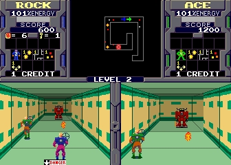

# Sinus och cosinus 4: skjutning

I den här lektionen ska vi använda en sinus och cosinus för att skjuta en kula



\sidbrytning

## Sinus och cosinus 4: uppgift 1

Skriv denna kod över:

```c++
float angle_gun = 0;

void setup()
{
  storlek (300, 200);
  strokeWeight(5);
}

void draw()
{
  bakgrund(255, 255, 255);
  final float x_center = width/2;
  final float y_middle = höjd / 2;
  final float x_gun = x_center + (cos(angle_gun) * 20);
  final float y_gun = y_center - (sin(angle_gun) * 20);
  line(x_center, y_center, x_gun, y_gun);
  ellips(x_center, y_center, 20, 20);
}
```

Vad ser du?

\sidbrytning

## Sinus och cosinus 4: lösning 1


Du ser en cirkel i mitten, med en kanon

\sidbrytning

## Sinus och cosinus 4: uppgift 2

 * Få kanonen att rotera genom att göra `angle_gun` mer och mer `0.1`


\sidbrytning

## Sinus och cosinus 4: lösning 2

```c++
float angle_gun = 0;

void setup()
{
  storlek (300, 200);
  strokeWeight(5);
}

void draw()
{
  bakgrund(255, 255, 255);
  final float x_center = width/2;
  final float y_middle = höjd / 2;
  final float x_gun = x_center + (cos(angle_gun) * 20);
  final float y_gun = y_center - (sin(angle_gun) * 20);
  line(x_center, y_center, x_gun, y_gun);
  ellips(x_center, y_center, 20, 20);
  angle_gun += 0,1;
}
```

\sidbrytning

## Sinus och cosinus 4: uppgift 3

 * Se till att `angle_gun` blir noll när du trycker på mellanslagstangenten

Dricks:

```c++
om (knapptryckt)
{
  if (nyckel == ' ')
  {
    //Sätt angle_gun till noll
  }
}
```


\sidbrytning

## Sinus och cosinus 4: lösning 3


```c++
float angle_gun = 0;

void setup()
{
  storlek (300, 200);
  strokeWeight(5);
}

void draw()
{
  bakgrund(255, 255, 255);
  final float x_center = width/2;
  final float y_middle = höjd / 2;
  final float x_gun = x_center + (cos(angle_gun) * 20);
  final float y_gun = y_center - (sin(angle_gun) * 20);
  line(x_center, y_center, x_gun, y_gun);
  ellips(x_center, y_center, 20, 20);
  angle_gun += 0,1;
  om (knapptryckt)
  {
    if (nyckel == ' ')
    {
      angle_gun = 0;
    }
  }
}
```

\sidbrytning

## Sinus och cosinus 4: uppgift 4

 * Gör variablerna `x_ball` och `y_kogel` högst upp
 * Ställ in de initiala värdena för `x_kogel` och `y_kogel` till noll
 * Rita en kula med mitten `(x_bullet, y_bullet)` med en cirkel som är 5 pixlar bred och hög


\sidbrytning

## Sinus och cosinus 4: lösning 4

```c++
float angle_gun = 0;
float x_bullet = 0;
flyta y_bullet = 0;

void setup()
{
  storlek (300, 200);
  strokeWeight(5);
}

void draw()
{
  bakgrund(255, 255, 255);
  final float x_center = width/2;
  final float y_middle = höjd / 2;
  final float x_gun = x_center + (cos(angle_gun) * 20);
  final float y_gun = y_center - (sin(angle_gun) * 20);
  line(x_center, y_center, x_gun, y_gun);
  ellips(x_center, y_center, 20, 20);
  ellips(x_ball, y_ball, 5, 5);
  angle_gun += 0,1;
  om (knapptryckt)
  {
    if (nyckel == ' ')
    {
      angle_gun = 0;
    }
  }
}
```

\sidbrytning

## Sinus och cosinus 4: uppgift 5

 * Om du trycker på mellanslagstangenten så ...
    * får `x_bullet` värdet av `x_gun`
    * får `y_bullet` värdet för `y_gun`
    * kanonen bara fortsätter snurra


\sidbrytning

## Sinus och cosinus 4: lösning 5

```c++
float angle_gun = 0;
float x_bullet = 0;
flyta y_bullet = 0;

void setup()
{
  storlek (300, 200);
  strokeWeight(5);
}

void draw()
{
  bakgrund(255, 255, 255);
  final float x_center = width/2;
  final float y_middle = höjd / 2;
  final float x_gun = x_center + (cos(angle_gun) * 20);
  final float y_gun = y_center - (sin(angle_gun) * 20);
  line(x_center, y_center, x_gun, y_gun);
  ellips(x_center, y_center, 20, 20);
  ellips(x_ball, y_ball, 5, 5);
  angle_gun += 0,1;
  om (knapptryckt)
  {
    if (nyckel == ' ')
    {
      x_bullet = x_gun;
      y_bullet = y_gun;
    }
  }
}
```

\sidbrytning

## Sinus och cosinus 4: uppgift 6

 * Skapa en ny variabel ovanför `setup-funktionen` med namnet `angle_ball`
 * Ge `corner_ball` startvärdet noll
 * Låt `x_ball` bli mer och mer med cosinus av `angle_ball`
 * Låt `y_ball` bli *mindre* med sinus för `angle_ball`


\sidbrytning

## Sinus och cosinus 4: lösning 6

```c++
float angle_gun = 0;
float x_bullet = 0;
flyta y_bullet = 0;
float angle_ball = 0;

void setup()
{
  storlek (300, 200);
  strokeWeight(5);
}

void draw()
{
  bakgrund(255, 255, 255);
  final float x_center = width/2;
  final float y_middle = höjd / 2;
  final float x_gun = x_center + (cos(angle_gun) * 20);
  final float y_gun = y_center - (sin(angle_gun) * 20);
  x_ball += cos(angle_ball);
  y_ball -= sin(angle_ball);
  line(x_center, y_center, x_gun, y_gun);
  ellips(x_center, y_center, 20, 20);
  ellips(x_ball, y_ball, 5, 5);
  angle_gun += 0,1;
  om (knapptryckt)
  {
    if (nyckel == ' ')
    {
      x_bullet = x_gun;
      y_bullet = y_gun;
    }
  }
}
```

\sidbrytning

## Sinus och cosinus 4: Slutuppgift

Nu avslutar vi spelet:

 * Se till att kulan inte är synlig i början (tips: ställ in `y_kogel` på minus hundra)
 * Om du trycker på blanksteg, ställ in `corner_bullet` lika med `corner_gun`


