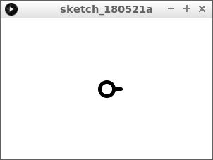
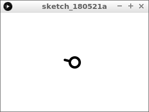
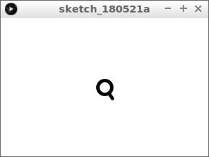
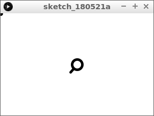
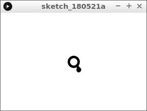
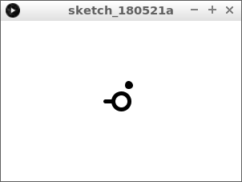
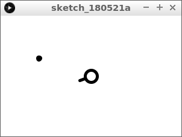

# Sinus och cosinus 4: skjutning

Under den här lektionen ska vi använda en sinus och cosinus för att skjuta en kula


\pagebreak

## Sinus och cosinus 4: uppgift 1

Skriv denna kod över:

```processing
float vinkel_kanon = 0;

void setup()
{
  size(300, 200);
  strokeWeight(5);
}

void draw()
{
  background(255, 255, 255);
  final float x_mitten = width / 2;
  final float y_mitten = height / 2;
  final float x_kanon = x_mitten + (cos(vinkel_kanon) * 20);
  final float y_kanon = y_mitten - (sin(vinkel_kanon) * 20);  
  line(x_mitten, y_mitten, x_kanon, y_kanon);
  ellipse(x_mitten, y_mitten, 20, 20);
}
```

Vad ser du?

\pagebreak

## Sinus och cosinus 4: lösning 1



Du ser en cirkel i mitten, med en kanon

\pagebreak

## Sinus och cosinus 4: uppgift 2

 * Få kanonen att rotera genom att göra `vinkel_kanon` mer och mer `0.1`



\pagebreak

## Sinus och cosinus 4: lösning 2

```processing
float vinkel_kanon = 0;

void setup()
{
  size(300, 200);
  strokeWeight(5);
}

void draw()
{
  background(255, 255, 255);
  final float x_mitten = width / 2;
  final float y_mitten = height / 2;
  final float x_kanon = x_mitten + (cos(vinkel_kanon) * 20);
  final float y_kanon = y_mitten - (sin(vinkel_kanon) * 20);  
  line(x_mitten, y_mitten, x_kanon, y_kanon);
  ellipse(x_mitten, y_mitten, 20, 20);
  vinkel_kanon += 0.1;
}
```

\pagebreak

## Sinus och cosinus 4: uppgift 3

 * Se till att `vinkel_kanon` blir noll när du trycker på mellanslagstangenten

Dricks:

```processing
if (keyPressed)
{
  if (key == ' ')
  {
    //Sett vinkel_kanon pa nol
  }
}
```


\pagebreak

## Sinus och cosinus 4: lösning 3



```processing
float vinkel_kanon = 0;

void setup()
{
  size(300, 200);
  strokeWeight(5);
}

void draw()
{
  background(255, 255, 255);
  final float x_mitten = width / 2;
  final float y_mitten = height / 2;
  final float x_kanon = x_mitten + (cos(vinkel_kanon) * 20);
  final float y_kanon = y_mitten - (sin(vinkel_kanon) * 20);  
  line(x_mitten, y_mitten, x_kanon, y_kanon);
  ellipse(x_mitten, y_mitten, 20, 20);
  vinkel_kanon += 0.1;
  if (keyPressed)
  {
    if (key == ' ')
    {
      vinkel_kanon = 0;
    }
  }
}
```

\pagebreak

## Sinus och cosinus 4: uppgift 4

 * Gör variablerna `x_kula` och `y_kula` högst upp
 * Ställ in de initiala värdena för `x_kula` och `y_kula` till noll
 * Rita en kula med mitten `(x_kula, y_kula)` med en cirkel som är 5 pixlar bred och hög



\pagebreak

## Sinus och cosinus 4: lösning 4

```processing
float vinkel_kanon = 0;
float x_kula = 0;
float y_kula = 0;

void setup()
{
  size(300, 200);
  strokeWeight(5);
}

void draw()
{
  background(255, 255, 255);
  final float x_mitten = width / 2;
  final float y_mitten = height / 2;
  final float x_kanon = x_mitten + (cos(vinkel_kanon) * 20);
  final float y_kanon = y_mitten - (sin(vinkel_kanon) * 20);  
  line(x_mitten, y_mitten, x_kanon, y_kanon);
  ellipse(x_mitten, y_mitten, 20, 20);
  ellipse(x_kula, y_kula, 5, 5);
  vinkel_kanon += 0.1;
  if (keyPressed)
  {
    if (key == ' ')
    {
      vinkel_kanon = 0;
    }
  }
}
```

\pagebreak

## Sinus och cosinus 4: uppgift 5

 * Om du trycker på mellanslagstangenten så ...
    * får `x_kula` värdet av `x_kanon`
    * får `y_kula` värdet för `y_kanon`
    * kanonen bara fortsätter snurra



\pagebreak

## Sinus och cosinus 4: lösning 5

```processing
float vinkel_kanon = 0;
float x_kula = 0;
float y_kula = 0;

void setup()
{
  size(300, 200);
  strokeWeight(5);
}

void draw()
{
  background(255, 255, 255);
  final float x_mitten = width / 2;
  final float y_mitten = height / 2;
  final float x_kanon = x_mitten + (cos(vinkel_kanon) * 20);
  final float y_kanon = y_mitten - (sin(vinkel_kanon) * 20);  
  line(x_mitten, y_mitten, x_kanon, y_kanon);
  ellipse(x_mitten, y_mitten, 20, 20);
  ellipse(x_kula, y_kula, 5, 5);
  vinkel_kanon += 0.1;
  if (keyPressed)
  {
    if (key == ' ')
    {
      x_kula = x_kanon;
      y_kula = y_kanon;
    }
  }
}
```

\pagebreak

## Sinus och cosinus 4: uppgift 6

 * Skapa en ny variabel ovanför `setup-funktionen` med namnet `vinkel_kula`
 * Ge `vinkel_kula` startvärdet noll
 * Låt `x_kula` bli mer och mer med cosinus av `vinkel_kula`
 * Låt `y_kula` bli *mindre* med sinus för `vinkel_kula`



\pagebreak

## Sinus och cosinus 4: lösning 6

```processing
float vinkel_kanon = 0;
float x_kula = 0;
float y_kula = 0;
float vinkel_kula = 0;

void setup()
{
  size(300, 200);
  strokeWeight(5);
}

void draw()
{
  background(255, 255, 255);
  final float x_mitten = width / 2;
  final float y_mitten = height / 2;
  final float x_kanon = x_mitten + (cos(vinkel_kanon) * 20);
  final float y_kanon = y_mitten - (sin(vinkel_kanon) * 20);
  x_kula += cos(vinkel_kula);
  y_kula -= sin(vinkel_kula);
  line(x_mitten, y_mitten, x_kanon, y_kanon);
  ellipse(x_mitten, y_mitten, 20, 20);
  ellipse(x_kula, y_kula, 5, 5);
  vinkel_kanon += 0.1;
  if (keyPressed)
  {
    if (key == ' ')
    {
      x_kula = x_kanon;
      y_kula = y_kanon;
    }
  }
}
```

\pagebreak

## Sinus och cosinus 4: Slutuppgift

Nu avslutar vi spelet:

 * Se till att kulan inte är synlig i början (tips: ställ in `y_kula` på minus hundra)
 * Om du trycker på blanksteg, ställ in `vinkel_kula` lika med `vinkel_kanon`



