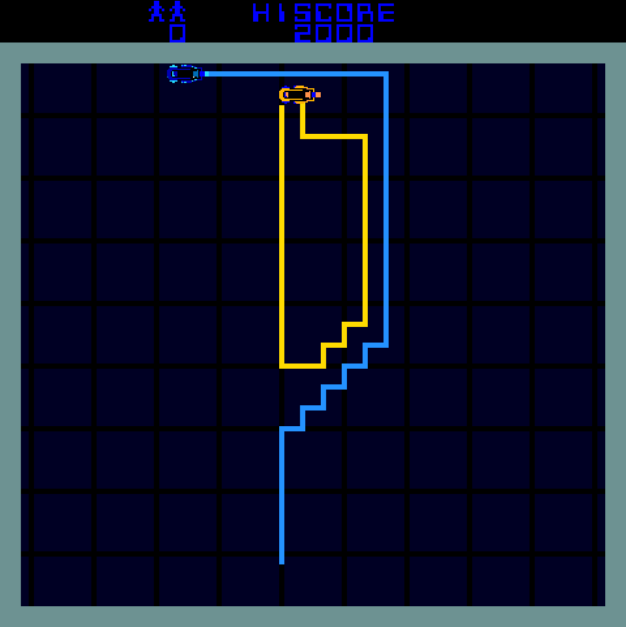

# Tangentbord 2: Tron

I den här lektionen ska vi styra en prick med tangentbordet.



\sidbrytning

## Tangentbord 2: intro


Detta är vår startkod. Skriv denna kod över:

```c++
float x = 0;
flytande y = 0;

// 0: upp
// 1: flytta åt höger
// 2: ner
// 3: till vänster
int riktning = 1;

void setup()
{
  storlek (200 200);
  x = bredd/2;
  y = höjd / 2;
}

void draw()
{
  om (knapptryckt)
  {
    om (nyckel == 'w') riktning = 0;
    om (nyckel == 'd') riktning = 1;
    om (nyckel == 's') riktning = 2;
    om (nyckel == 'a') riktning = 3;
  }
  om (riktning == 0) y = y - 1;
  om (riktning == 1) x = x + 1;
  om (riktning == 2) y = y + 1;
  om (riktning == 3) x = x - 1;
  punkt(x,y);
}
```

Starta programmet och tryck på ADSW för att ändra riktning.

 | Kontrollerna är inte perfekta! Att göra detta perfekt är lite svårare
:-----------------:|:---------------------- ------- :

\sidbrytning

## Tangentbord 2: Kommando 1

När spelaren till höger går ut ur bilden, se till att
den visas till höger.


\sidbrytning

## Tangentbord 2: Lösning 1

Du behöver en "om"-sats:

```c++
float x = 0;
flytande y = 0;

// 0: upp
// 1: flytta åt höger
// 2: ner
// 3: till vänster
int riktning = 1;

void setup()
{
  storlek (200 200);
  x = bredd/2;
  y = höjd / 2;
}

void draw()
{
  om (knapptryckt)
  {
    om (nyckel == 'w') riktning = 0;
    om (nyckel == 'd') riktning = 1;
    om (nyckel == 's') riktning = 2;
    om (nyckel == 'a') riktning = 3;
  }
  om (riktning == 0) y = y - 1;
  om (riktning == 1) x = x + 1;
  om (riktning == 2) y = y + 1;
  om (riktning == 3) x = x - 1;
  om (x > bredd) x = 0;
  punkt(x,y);
}
```

 | 
:-----------------:|:---------------------- ------- :
`if (x > width) x = 0`|'Bästa dator, om `x` är större än `width`, ställ `x` till noll.'

\sidbrytning

## Tangentbord 2: Kommando 2

Se till att *även* om spelaren längst upp på skärmen släcks, att
det visas längst ner.


\sidbrytning

## Tangentbord 2: Lösning 2

```c++
float x = 0;
flytande y = 0;

// 0: upp
// 1: flytta åt höger
// 2: ner
// 3: till vänster
int riktning = 1;

void setup()
{
  storlek (200 200);
  x = bredd/2;
  y = höjd / 2;
}

void draw()
{
  om (knapptryckt)
  {
    om (nyckel == 'w') riktning = 0;
    om (nyckel == 'd') riktning = 1;
    om (nyckel == 's') riktning = 2;
    om (nyckel == 'a') riktning = 3;
  }
  om (riktning == 0) y = y - 1;
  om (riktning == 1) x = x + 1;
  om (riktning == 2) y = y + 1;
  om (riktning == 3) x = x - 1;
  om (x > bredd) x = 0;
  om (y < 0) y = höjd;
  punkt(x,y);
}
```

\sidbrytning

## Tangentbord 2: Sista kommandot

Se till att spelaren alltid finns kvar i bilden.


