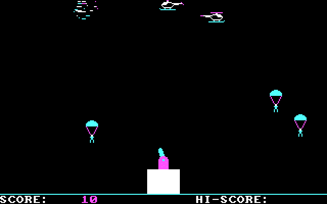

# Tangentbord 4: Fallskärmsjägare

I den här lektionen ska vi styra en kanon med pilarna.



\sidbrytning

## Tangentbord 4: intro


Detta är vår startkod. Skriv denna kod över:

```c++
flytvinkel = 1,5707963268; // Hälften av pi

void setup()
{
  storlek(300, 200);
  strokeWeight(5);
}

void draw()
{
  bakgrund(255, 255, 255);
  slutlig flottör x1 = bredd/2;
  slutlig flottör y1 = höjd;
  slutlig float x2 = x1 + (cos(vinkel) * 100);
  slutlig flottör y2 = y1 - (sin(vinkel) * 100);
  linje(xl, yl, x2, y2);
  ellips(xl, yl, 100, 100);
  
  om (knapptryckt)
  {
    if (nyckelkod == VÄNSTER) vinkel += 0,01;
    om (nyckelkod == HÖGER) vinkel -= 0,01;
  }
}
```

Starta programmet och använd vänster- och högerpilarna för att styra kanonen

 | Med `final` säger du att en variabel inte får ändras
:-----------------:|:---------------------- ------- :

\sidbrytning

## Tangentbord 4: Kommando 1

Se till att pistolens vinkel inte är det
0,7853981634 (en kvart pi) kommer.
Kanonen måste då stanna på det hörnet.


\sidbrytning

## Tangentbord 4: Lösning 1

Du behöver en "om"-sats:

```c++
flytvinkel = 1,5707963268; // Hälften av pi

void setup()
{
  storlek(300, 200);
  strokeWeight(5);
}

void draw()
{
  bakgrund(255, 255, 255);
  slutlig flottör x1 = bredd/2;
  slutlig flottör y1 = höjd;
  slutlig float x2 = x1 + (cos(vinkel) * 100);
  slutlig flottör y2 = y1 - (sin(vinkel) * 100);
  linje(xl, yl, x2, y2);
  ellips(xl, yl, 100, 100);
  
  om (knapptryckt)
  {
    if (nyckelkod == VÄNSTER) vinkel += 0,01;
    om (nyckelkod == HÖGER) vinkel -= 0,01;
  }
  om (vinkel < 0,7853981634) vinkel = 0,7853981634; //En kvart pi
}
```

\sidbrytning

## Tangentbord 4: Sista kommando

Se till att pistolens vinkel inte är över
2,35619449019 (tre fjärdedels pi) kommer.
Kanonen måste då stanna på det hörnet.


