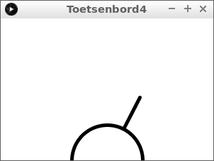
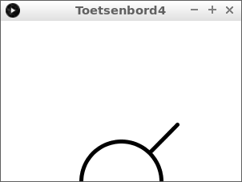
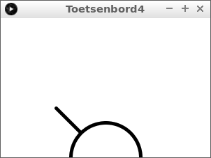

# Tangentbord 4: Paratrooper

I den här lektionen ska vi styra en kanon med pilarna.


\pagebreak

## Tangentbord 4: intro



Detta är vår startkod. Skriv denna kod över:

```c++
float vinkel = 1.5707963268; // Halften av pi

void setup()
{
  size(300, 200);  
  strokeWeight(5);
}

void draw()
{
  background(255, 255, 255);
  final float x1 = width / 2;
  final float y1 = height;
  final float x2 = x1 + (cos(vinkel) * 100);
  final float y2 = y1 - (sin(vinkel) * 100);  
  line(x1, y1, x2, y2);
  ellipse(x1, y1, 100, 100);
  
  if (keyPressed)
  {
    if (keyCode == LEFT) vinkel += 0.01;
    if (keyCode == RIGHT) vinkel -= 0.01;
  }
}
```

Starta programmet och använd vänster- och högerpilarna för att styra kanonen

 | Med `final` säger du att en variabel inte får ändras
:-----------------:|:-----------------------------:

\pagebreak

## Tangentbord 4: Uppgift 1

Se till att pistolens vinkel inte är det
0,7853981634 (en kvart pi) kommer.
Kanonen måste då stanna på det hörnet.



\pagebreak

## Tangentbord 4: Lösning 1

Du behöver en "om"-sats:

```c++
float vinkel = 1.5707963268; // Halften av pi

void setup()
{
  size(300, 200);  
  strokeWeight(5);
}

void draw()
{
  background(255, 255, 255);
  final float x1 = width / 2;
  final float y1 = height;
  final float x2 = x1 + (cos(vinkel) * 100);
  final float y2 = y1 - (sin(vinkel) * 100);  
  line(x1, y1, x2, y2);
  ellipse(x1, y1, 100, 100);
  
  if (keyPressed)
  {
    if (keyCode == LEFT) vinkel += 0.01;
    if (keyCode == RIGHT) vinkel -= 0.01;
  }
  if (vinkel < 0.7853981634) vinkel = 0.7853981634; //En kvart pi
}
```

\pagebreak

## Tangentbord 4: Slutuppgift

Se till att pistolens vinkel inte är över
2,35619449019 (tre fjärdedels av pi) kommer.
Kanonen måste då stanna på det hörnet.


