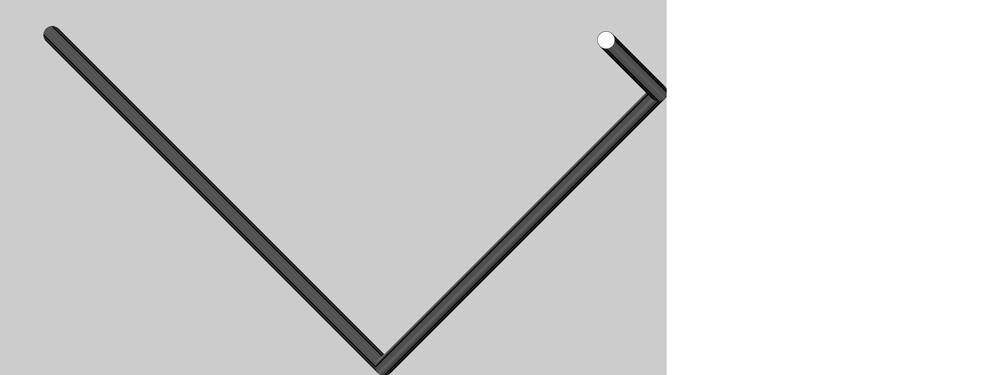

# Tyngdkraft

I den här lektionen ska vi programmera gravitationen.

Vi kommer att använda två variabler och två "om"-satser i den här lektionen.

\pagebreak

## Tyngdkraft: uppgift 1

Vad gör den här koden?

```c++
float x = 150;
float y = 100;
float hastighet_till_hoger = 1;
float hastighet_till_nedat = 1;

void setup()
{
  size(300, 200);
}

void draw()
{
  ellipse(x, y, 50, 50);
  x = x + hastighet_till_hoger;
  y = y + hastighet_till_nedat;
  if (x > 275)
  {
    hastighet_till_hoger = -hastighet_till_hoger;
  }
  if (x < 25)
  {
    hastighet_till_hoger = -hastighet_till_hoger;
  }
  if (y > 175)
  {
    hastighet_till_nedat = -hastighet_till_nedat;
  }
}
```

\pagebreak

## Tyngdkraft: Lösning 1


\pagebreak

## Tyngdkraft: uppgift 2

Se till att programmet är i helskärm


\pagebreak

## Tyngdkraft: Lösning 2

```c++
float x = 150;
float y = 100;
float hastighet_till_hoger = 1;
float hastighet_till_nedat = 1;

void setup()
{
  fullScreen();
}

void draw()
{
  ellipse(x, y, 50, 50);
  x = x + hastighet_till_hoger;
  y = y + hastighet_till_nedat;
  if (x > 275)
  {
    hastighet_till_hoger = -hastighet_till_hoger;
  }
  if (x < 25)
  {
    hastighet_till_hoger = -hastighet_till_hoger;
  }
  if (y > 175)
  {
    hastighet_till_nedat = -hastighet_till_nedat;
  }
}
```

\pagebreak

## Tyngdkraft: uppgift 3


Se till att bollen studsar bra i botten.

 | Tips: ersätt `175` med `höjd - 25`
:-----------------:|:------------------------------:

\pagebreak

## Tyngdkraft: Lösning 3

```c++
float x = 150;
float y = 100;
float hastighet_till_hoger = 1;
float hastighet_till_nedat = 1;

void setup()
{
  fullScreen();
}

void draw()
{
  ellipse(x, y, 50, 50);
  x = x + hastighet_till_hoger;
  y = y + hastighet_till_nedat;
  if (x > 275)
  {
    hastighet_till_hoger = -hastighet_till_hoger;
  }
  if (x < 25)
  {
    hastighet_till_hoger = -hastighet_till_hoger;
  }
  if (y > height - 25)
  {
    hastighet_till_nedat = -hastighet_till_nedat;
  }
}
```

\pagebreak

## Tyngdkraft: uppgift 4

Se till att bollen studsar bra på höger sida.



\pagebreak

## Tyngdkraft: Lösning 4

```c++
float x = 150;
float y = 100;
float hastighet_till_hoger = 1;
float hastighet_till_nedat = 1;

void setup()
{
  fullScreen();
}

void draw()
{
  ellipse(x, y, 50, 50);
  x = x + hastighet_till_hoger;
  y = y + hastighet_till_nedat;
  if (x > width - 25)
  {
    hastighet_till_hoger = -hastighet_till_hoger;
  }
  if (x < 25)
  {
    hastighet_till_hoger = -hastighet_till_hoger;
  }
  if (y > height - 25)
  {
    hastighet_till_nedat = -hastighet_till_nedat;
  }
}
```

\pagebreak

## Tyngdkraft: Final Command

Lägg till "rita"-funktionen längst ned:

```c++
hastighet_till_nedat += 0.1;
```

Gör bollen dubbelt så stor.


Om din program ser ut som bild nedåt, får du också
ett klistermärke.

 | Ibland händer oväntade saker i programmering!
:-----------------:|:-----------------------------:


